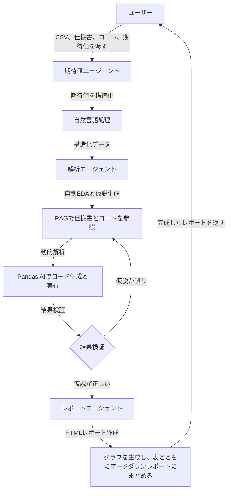

# AIアルゴリズム異常解析システム 仕様書（最新版）


この仕様書は、AIアルゴリズム異常解析システムの設計を詳細に説明します。ユーザーが提供するCSVデータ、仕様書、ソースコード、自然言語の期待値をもとに、マルチエージェント構成のコーディングエージェントが課題箇所の状態を確認し、仕様書と照らし合わせて仮説を立て、解析条件（例: 参照列、解析指標、範囲）を動的に調整しながらコードを生成・実行します。結果検証で仮説が誤っている場合、仮説生成にループバックし、精度を向上させます。結果はマークダウン形式で、グラフ、表、を含むレポートとして出力されます。

---

## 目次
1. [システム概要](#1-システム概要)  
2. [システムの流れ](#2-システムの流れ)  
3. [入力と出力](#3-入力と出力)  
4. [主要コンポーネント](#4-主要コンポーネント)  
5. [機能の詳細](#5-機能の詳細)  
6. [システムの動かし方](#6-システムの動かし方)  
7. [サンプルコード](#7-サンプルコード) 
8. [まとめ](#9-まとめ)  

---

## 1. システム概要

### 1.1 目的
このシステムは、アルゴリズムの検知結果（CSV）、アルゴリズムへの入力結果（CSV）、ユーザーの期待値（自然言語）を比較し、異常箇所を特定します。マルチエージェント構成（期待値エージェント、解析エージェント、レポートエージェント）が、仕様書やソースコードを参照して仮説を立て、解析条件を動的に調整し、コードを生成・実行します。結果検証で仮説が誤っている場合、仮説生成にループバックします。結果はマークダウン形式のレポートとして、初心者にもわかりやすく提供されます。


### 1.2 主な特徴
- **自然言語対応**: 定型句テンプレートとLLMを組み合わせ、期待値を安定して解釈。
- **マルチエージェント**: 期待値解釈、データ解析、仮説生成、レポート作成を専任エージェントで分担。
- **動的解析**: Pandas AIを活用し、参照列、解析指標、範囲を自動調整。
- **仮説ループバック**: 結果検証で仮説が誤っている場合、仮説生成に再挑戦（最大試行回数まで）。
- **RAG活用**: 仕様書やコードから情報を効率的に抽出。
- **インタラクティブ可視化**: Plotlyやseaborn, matplotlib, polarsでグラフを生成し、レポートに埋め込み。
- **安定性**: 段階的処理と中間確認でエラーを軽減。

---

## 2. システムの流れ

### 2.1 全体の流れ
1. **データ入力**: ユーザーがCSVファイル、仕様書、ソースコード、自然言語の期待値を提供。
2. **期待値解釈**: 期待値エージェントが自然言語を構造化データ（JSON）に変換。
3. **状態確認と仮説生成**: 解析エージェントがデータ状態を確認し、RAGで仕様書・コードを参照して仮説を生成。
4. **動的解析**: 解析エージェントがPandas AIで適切な列、指標、範囲を選び、コードを生成・実行。
5. **結果検証**: 解析結果と仮説を検証。仮説が誤っている場合、仮説生成にループバック。
6. **レポート生成**: レポートエージェントが結果をPlotlyやseaborn, matplotlib, polarsでグラフを生成し、表とともにマークダウンレポートにまとめる。
7. **出力**: 完成したレポートをユーザーに提供。

### 2.2 フローチャート


### 2.3 課題フォーマットとエージェントの動作
- **課題フォーマット**: 「フレーム x~y は項目 z が w であるべき」
- **エージェントの動作（5ステップ）**
  1. 結果の確認: 仕様書・ソースコードから入力内容が正しいか確認（z の定義、w の意味/単位、前処理の有無）
  2. 仮説検討のためのデータ収集: 入力データ源を特定・アクセスし、該当区間 x~y の入力値を抽出。フレーム数が多い場合は時系列や出力との対応関係を可視化
  3. 仮説の検討: input と output の整合を確認。仕様通りなら 4 で input 詳細解析、仕様外なら 4 で仕様・ソースコードの詳細分析
  4. 仮説が正しいかを検証: 境界条件、欠損時処理、座標変換など具体例に基づく詳細解析
  5. 出力: 仮説が正しければ課題として出力。誤っていれば 2 に戻って再検討（最大試行回数まで）

---


## 3. 入力と出力の例
### 例１（閾値設定に問題があるケース）

1. **CSVファイル（アルゴリズムの出力結果）**:
   - **CSV例**: `data.csv`
     ```
     frame, eye_close
     1,0
     2,0
     10,0
     11,0
     ```
2. **CSVファイル（アルゴリズムの入力データ）**:
   - **CSV例**: `input_data.csv`
     ```
     frame, ley_openness, rey_openness, face_confidence
     1,0.8,0.7,0.9
     2,0.7,0.6,0.8
     10,0.1,0.1,0.95
     11,0.1,0.1,0.96
     ```

3. **仕様書（Markdown）**: アルゴリズムの動作仕様。
   - 例: `spec.md`
     ```markdown
     ## 仕様
     - reye_opennessが0.1以下かつ、leye_opennessが0.1以下である場合、eye_closeが1であるべき
     ```
4. **ソースコード（Python）**: アルゴリズムの実装。
   - 例: `source.py`
     ```python
     def detect_value(frame, category):
         # 仕様: reye_opennessが0.1以下かつ、leye_opennessが0.1以下である場合、eye_closeが1であるべき
         if reye_openness < 0.01 and leye_openness < 0.01:
             return 1
         else:
             return 0
     ```
5. **期待値（自然言語）**: ユーザーの期待する結果。
   - 例: 「frame 10~11は eye_closeが1であるべき」

6. **出力結果**:
    ```
    # 異常解析レポート

    ## 概要
    - データ: data.csv
    - 期待値: "フレーム10~11は eye_closeが1であるべき"

    ## 異常の詳細
    ### 異常1
    - **場所**: フレーム10~11（該当フレームをハイライト）
    - **検出値**: 区間内の実測分布（例: 0 を中心）
    - **期待値**: 1
    - **仮説**: 区間 10~11 に対する条件分岐の不整合。
    - **グラフ**: [閉眼閾値付きのreye_opennessとleye_opennessの区間ハイライト付き折れ線グラフと、eye_closeの区間ハイライト付き折れ線グラフ]


    ## サマリ
    -  区間10~11で期待と異なる値が出ています。閾値設定に問題があり、左右目の閉眼閾値が0.01と設定されているため、閉眼と判定されていません。
    グラフ：[閉眼閾値付きのreye_opennessとleye_opennessの区間ハイライト付き折れ線グラフと、eye_closeの区間ハイライト付き折れ線グラフ]
    ```

### 例２（入力情報に異常があるケース）
#### 3.2 入力
  - 1. **CSVファイル（アルゴリズムの出力結果）**:
   - **CSV例**: `data.csv`
     ```
     frame, eye_close
     1,0
     2,0
     10,0
     11,0
     ```
1. **CSVファイル（アルゴリズムの入力データ）**:
   - **CSV例**: `input_data.csv`
     ```
     frame, ley_openness, rey_openness, face_confidence
     1,0.7,0.7,0.9
     2,0.7,0.6,0.8
     10,0.7,0.7,0.95
     11,0.8,0.8,0.96
     ```
2. **仕様書（Markdown）**: アルゴリズムの動作仕様。
   - 例: `spec.md`
     ```markdown
     ## 仕様
     - reye_opennessが0.1以下かつ、leye_opennessが0.1以下である場合、eye_closeが1であるべき
     ```
3. **ソースコード（Python）**: アルゴリズムの実装。
   - 例: `source.py`
     ```python
     def detect_value(frame, category):
         # 仕様: reye_opennessが0.1以下かつ、leye_opennessが0.1以下である場合、eye_closeが1であるべき
         if reye_openness < 0.1 and leye_openness < 0.1:
             return 1
         else:
             return 0
     ```

  
5. **期待値（自然言語）**: ユーザーの期待する結果。
   - 例: 「frame 10~11は eye_closeが1であるべき」
  - 出力結果:
    ```
    # 異常解析レポート

    ## 概要
    - データ: data.csv
    - 期待値: "フレーム10~11は eye_closeが1であるべき"

    ## 異常の詳細
    ### 異常1
    - **場所**: フレーム10~11（該当フレームをハイライト）
    - **検出値**: 区間内の実測分布（例: 0 を中心）
    - **期待値**: 1
    - **仮説**: 区間 10~11 の入力値が0.7~0.8となっており、期待値の0.1以下と異なっています。動画を確認して被験者が実際に閉眼をしているかどうか確認してください。
    - **グラフ**: [閉眼閾値付きのreye_opennessとleye_opennessの区間ハイライト付き折れ線グラフと、eye_closeの区間ハイライト付き折れ線グラフ]
    ```

---

## 4. 主要コンポーネント

### 4.1 マルチエージェント構成
- **期待値エージェント**:
  - **役割**: 自然言語の期待値を構造化データ（JSON）に変換。
  - **技術**: LangChain + OpenAI ChatGPTモデル + SQL Database Agent。
- **解析エージェント**:
  - **役割**: 仮説生成（RAG）、動的解析（Pandas AI）、結果検証、ループバック。
  - **技術**: LangChain + Pandas AI + FAISS + AST解析。
- **レポートエージェント**:
  - **役割**: 解析結果をPlotlyグラフや表とともにレポートにまとめる。
  - **技術**: Jinja2 + Plotly + seaborn, matplotlib, polarsなどでグラフを生成。

### 4.2 ツール
- **自然言語処理**: 定型句テンプレート＋LLMフォールバック。
- **データ処理**: Pandas AIでCSV/データベースを処理。
- **自動EDA**: 欠損値や異常値の分析。
- **グラフ作成**: Plotlyやseaborn, matplotlib, polarsなどでグラフを生成。
- **レポート生成**: Markdownテンプレート（Jinja2）。
- **検索（RAG）**: FAISSで仕様書やコードから情報抽出。
- **コード解析**: AST解析でソースコードのロジック分析。

---

## 5. 機能の詳細

### 5.1 自然言語の期待値の解釈
- **対応範囲**
  - **単一値**: 「フレーム10の値は5であるべき」
  - **範囲指定**: 「フレーム100~120は value が5であるべき」
  - **集計**: 「フレーム1から10の合計が50であるべき」
  - **パターン**: 「値はフレームごとに単調増加するべき」
  - **条件付き**: 「categoryがAの場合、値は10未満」
  - **データベース**: 「フレーム10のデータを取得」

- **実装方法**
  - **定型句テンプレート**: 「XがYならZ」「Xの合計はZ」などの形式を正規表現で解析。
  - **LLMフォールバック**: 非定型な入力はChatGPTでJSON形式に構造化。
  - **Text2SQL**: データベースクエリを生成（例: `SELECT value FROM table WHERE frame = 10`）。
  - **曖昧性対応**: 不明瞭な入力の場合、ユーザーに具体性を求めるフィードバック。

- **例**
  - **入力**: 「categoryがAの場合、値は10未満であるべき」
  - **解釈**: `{"condition": "category == 'A'", "constraint": "value < 10"}`
  - **処理**: Pandas AIで`df.loc[df['category'] == 'A', 'value'] < 10`を評価。

### 5.2 課題箇所の状態確認と仮説生成
- **プロセス**
  1. **自動EDA**: 欠損値、異常値、分布を分析。
  2. **仮説生成**: RAG（FAISS）で仕様書とコードを検索し、AST解析と組み合わせて異常の原因を推測。
  3. **構造化比較**: 仕様書をJSON形式に変換し、コードの出力と比較。
  4. **中間確認**: 仮説の妥当性をログに記録。

- **例**
  - **状態**: フレーム10で値15、category A。
  - **仕様書**: 「フレーム10の値は5」「category Aは10未満」
  - **コード**: `if frame == 10: return 15`
  - **仮説**: 条件分岐の戻り値ミス、カテゴリ条件の未実装。

### 5.3 動的解析
- **プロセス**
  - **列選択**: 仕様書や期待値に基づき、関連列（例: `frame`, `value`, `category`）を選択。
  - **指標調整**: Pandas AIで平均、最大値、単調性などを動的に適用。
  - **範囲調整**: フレーム範囲やカテゴリを絞り込む。
  - **コード生成**: Pandas AIが自然言語からPandasコードを生成・実行。
  - **中間確認**: 解析結果をログに記録。

- **例**
  - **期待値**: 「category Aのフレーム1-10の値は単調増加」
  - **コード生成**:
    ```python
    result = pandas_ai.run(df, prompt="category Aのフレーム1-10の値が単調増加かチェック")
    ```

### 5.4 結果検証とループバック
- **プロセス**
  - **検証**: 解析結果と仮説を比較（例: 異常が仕様書と一致するか）。
  - **ループバック**: 仮説が誤っている場合（例: 原因が特定できない）、設定値 `max_attempts`（デフォルト3）まで新たな仮説を生成し再解析。
  - **判定基準**: 仕様書との不一致度やコードの出力との差異をスコアリング。
  - **ログ**: 検証結果とループバックの理由を記録。

- **例**
  - **検証**: フレーム10の値15が仕様（5）と不一致。
  - **仮説**: 条件分岐ミス。
  - **結果**: 仮説がコードと一致しない場合、別の仮説（例: 入力データエラー）を生成し再解析。

### 5.5 レポートの構造とカスタマイズ性
- **構造**
  ```
  # 異常解析レポート
  ## 概要
  - データ: data.csv
  - 期待値: "フレーム100~120は項目 value が 5 であるべき" "categoryがAの場合、valueは10未満"
  ## 異常の詳細
  ### 異常1
  - **場所**: フレーム100~120
  - **検出値**: 区間内の実測分布
  - **期待値**: 5
  - **差分**: 区間平均差分、最大逸脱
  - **仮説**: 前処理/閾値設定の不整合
  - **グラフ**: [区間ハイライト付き折れ線グラフ]
  ### 異常2
  - **場所**: フレーム100~120、category A
  - **検出値**: 7（例）
  - **期待値**: 10未満
  - **仮説**: カテゴリ条件がコードで考慮されていない
  - **表**: [カテゴリごとの値の分布]
  ## サマリ
  - 初心者向け: 区間100~120で期待と異なる値が出ています。コードの前処理や閾値設定に問題があり、category Aの条件も無視されています。
  ```

- **カスタマイズ性**
  - **出力形式**: マークダウン（デフォルト）、PDF（オプション）。
  - **画像出力（デフォルト）**: 静的画像（jpg/png）を生成し、レポートにリンク（AI分析エンジン設計書に準拠）。
  - **インタラクティブ可視化（オプション）**: Plotlyのインタラクティブ表示（例: ズーム可能な折れ線グラフ）は必要時のみ有効化。
  - **オプション**: グラフの種類、詳細度。
  - **テンプレート**: マークダウンテンプレートをカスタマイズ可能。

### 5.6 マルチエージェントの自律性
- **期待値エージェント**: 自然言語を構造化データやSQLクエリに変換。
- **解析エージェント**: 自動EDA、仮説生成、コード生成・実行、結果検証、ループバック。
- **レポートエージェント**: Plotlyで可視化し、画像リンク付きのマークダウンレポートを生成。
- **中間確認**: 各ステップの出力をログに記録し、必要に応じてユーザーに確認を求める。

---

### 5.7 インターフェース仕様（API）

本エージェントは具体的な解析ツールに依存しない抽象APIで構成します。

```
POST /agents/instance-analysis/run
Request JSON:
{
  "run_id": "string",
  "dataset": { "path": "relative/path/to/csv", "schema": "InstanceDatasetV1" },
  "expectations": [ { "type": "range" | "point" | "aggregate" | "pattern", "expr": "string" } ],
  "context": { "spec_paths": ["...md"], "code_roots": ["src/"] },
  "options": { "max_attempts": 3, "timeout_sec": 900, "visualization": { "level": "standard" } }
}

Response JSON:
{
  "run_id": "string",
  "status": "success" | "partial" | "failed",
  "summary": { "num_cases": 12, "num_findings": 5 },
  "artifacts": {
    "reports": ["reports/instance/123/report.md"],
    "images": ["reports/instance/123/images/time_series.jpg"],
    "data": ["reports/instance/123/data/analysis_summary.json"]
  },
  "errors": [ { "code": "E-ANALYZE-TIMEOUT", "message": "string" } ]
}
```

### 5.8 データスキーマ（抜粋）

```json
{
  "$schema": "https://json-schema.org/draft/2020-12/schema",
  "$id": "InstanceDatasetV1",
  "type": "object",
  "properties": {
    "rows": {
      "type": "array",
      "items": {
        "type": "object",
        "properties": {
          "frame": { "type": "integer" },
          "timestamp_ms": { "type": "number" },
          "inputs": { "type": "object" },
          "outputs": { "type": "object" },
          "labels": { "type": "object" }
        },
        "required": ["frame"]
      }
    }
  }
}
```

- Expectation（期待値）
```json
{
  "$id": "ExpectationV1",
  "type": "object",
  "properties": {
    "type": { "enum": ["range", "point", "aggregate", "pattern"] },
    "expr": { "type": "string", "description": "自然言語またはDSL" },
    "target": { "type": "string", "description": "列または特徴名" },
    "range": { "type": "object", "properties": { "start": {"type":"integer"}, "end": {"type":"integer"} } }
  },
  "required": ["type", "expr"]
}
```

- Finding（検出結果）
```json
{
  "$id": "FindingV1",
  "type": "object",
  "properties": {
    "id": { "type": "string" },
    "location": { "type": "object", "properties": { "frame_start": {"type":"integer"}, "frame_end": {"type":"integer"} } },
    "observed": { "type": "object" },
    "expected": { "type": "object" },
    "diff": { "type": "object" },
    "hypothesis": { "type": "string" },
    "confidence": { "type": "number" }
  },
  "required": ["id", "location", "observed", "expected"]
}
```

### 5.9 プラグインアーキテクチャ（ツール非依存）

- 目的: 解析エンジンは任意のツール（統計/可視化/モデル）をプラグインとして追加可能。
- インターフェース（疑似コード）
```python
class AnalyzerPlugin:
    """Tool-agnostic analyzer plugin interface."""

    def get_name(self) -> str: ...

    def supports(self) -> dict:
        return {"expectation_types": ["range", "point", "aggregate", "pattern"]}

    def analyze(self, dataset_ref: str, expectations: list, context: dict, options: dict) -> dict:
        """Return findings, intermediate artifacts, and logs."""
        ...

    def visualize(self, findings: list, output_dir: str, options: dict) -> list:
        """Return list of generated image paths."""
        ...
```

- プラグイン解決ポリシー
  - 優先度: 明示的指定 > 能力宣言の一致 > デフォルト
  - フォールバック: 失敗時は別プラグインに委譲（最大 `max_attempts` 回）

### 5.10 設定（例）

```yaml
max_attempts: 3
timeout_sec: 900
visualization:
  level: standard   # basic|standard|detailed
logging:
  level: INFO
output_dir: reports/instance/${run_id}/
```

### 5.11 エラーハンドリング

- 代表コードと対処
  - E-INPUT-SCHEMA: スキーマ不一致 → スキーマ検証を実行し詳細を返却
  - E-ANALYZE-TIMEOUT: 解析タイムアウト → 中断し部分結果を返却
  - E-VISUALIZE: 可視化失敗 → 代替チャートにフォールバック

### 5.12 成果物とディレクトリ構成

```
reports/instance/${run_id}/
├─ report.md
├─ images/
│  ├─ time_series.jpg
│  └─ findings_heatmap.jpg
└─ data/
   ├─ analysis_summary.json  # FindingV1[]
   └─ logs.json
```

### 5.13 メトリクス・ログ

- メトリクス例: 解析所要時間、検出件数、期待値カバレッジ、再試行回数
- ログレベル: DEBUG/INFO/WARN/ERROR、構造化JSONで保存

### 5.14 セキュリティ・プライバシー

- 個人情報列のマスキング方針（configで列指定）
- 外部API利用時のキーは環境変数から取得、成果物には保存しない


## 6. システムの動かし方

### 6.1 データ準備
1. CSVファイル（例: `data.csv`）。
2. 仕様書（例: `spec.md`）とソースコード（例: `source.py`）。
3. 期待値を記述（例: 「フレーム100~120は項目 value が 5 であるべき」「categoryがAの場合、valueは10未満」）。

### 6.2 システム起動
1. マルチエージェントを初期化し、解析を依頼。
2. 各エージェントが段階的に処理を実行。結果検証で仮説が誤っている場合は仮説生成にループバック（最大3回）。
3. レポートエージェントがMarkdownレポートを生成。

### 6.3 結果確認
- 生成されたMarkdownレポートと画像を確認。

---

## 7. サンプルコード

以下は、Pandas AI、SQL Database Agent、RAG、Plotlyを活用したマルチエージェント構成のサンプルコードです。

### 7.1 マルチエージェントの設定（例・将来案）
```python
from langchain.agents import initialize_agent, AgentType
from langchain.tools import Tool
from langchain.chat_models import ChatOpenAI
from langchain.vectorstores import FAISS
from langchain.embeddings import OpenAIEmbeddings
from langchain.document_loaders import TextLoader
from pandasai import PandasAI
import pandas as pd
import plotly.express as px
from jinja2 import Template
import json
import re

# 期待値エージェントのツール
def parse_expectation(expectation_text):
    templates = {
        r"(\w+)が(\w+)なら(\w+)([<>=]\d+)": lambda m: {"column": m[0], "condition": m[1], "constraint": f"{m[2]}{m[3]}"},
        r"(\w+)の合計は(\d+)": lambda m: {"column": m[0], "operation": "sum", "value": int(m[1])},
    }
    structured = []
    for exp in expectation_text.split("、"):
        for pattern, parser in templates.items():
            match = re.match(pattern, exp.strip())
            if match:
                structured.append(parser(match.groups()))
                break
        else:
            llm = ChatOpenAI(model="gpt-4")
            prompt = f"Convert to JSON: {exp}"
            structured.append(json.loads(llm.predict(prompt)))
    return structured

# 解析エージェントのツール
def analyze_data(data_path, structured_expectation):
    df = pd.read_csv(data_path)
    pandas_ai = PandasAI()
    results = []
    for exp in structured_expectation:
        if "condition" in exp:
            prompt = f"Check if {exp['condition']} satisfies {exp['constraint']}"
            result = pandas_ai.run(df, prompt=prompt)
            results.append({"condition": exp["condition"], "violations": result})
        elif "operation" in exp:
            prompt = f"Calculate {exp['operation']} of {exp['column']} and compare with {exp['value']}"
            result = pandas_ai.run(df, prompt=prompt)
            results.append({"operation": exp["operation"], "expected": exp["value"], "actual": result})
    return results

def generate_hypothesis(analysis_results, spec_path, code_path):
    loader = TextLoader(spec_path)
    documents = loader.load()
    vector_store = FAISS.from_documents(documents, OpenAIEmbeddings())
    relevant_docs = vector_store.similarity_search("異常の原因")
    with open(code_path) as f:
        code = f.read()
    llm = ChatOpenAI(model="gpt-4")
    prompt = f"""
    Analysis results: {analysis_results}
    Specification: {relevant_docs}
    Source code: {code}
    Generate a hypothesis for the anomalies.
    """
    return llm.predict(prompt)

def verify_results(analysis_results, hypothesis):
    llm = ChatOpenAI(model="gpt-4")
    prompt = f"""
    Analysis results: {analysis_results}
    Hypothesis: {hypothesis}
    Verify if the hypothesis explains the anomalies. Return JSON: {{"valid": bool, "reason": str}}
    """
    return json.loads(llm.predict(prompt))

# レポートエージェントのツール（Markdown出力）
def create_graph(data):
    df = pd.DataFrame(data[0]["violations"])
    fig = px.line(df, x="frame", y="value", title="Value Anomalies")
    out_path = "images/time_series.jpg"
    fig.write_image(out_path)
    return out_path

def generate_report_md(data, images, hypothesis):
    with open('template.md.j2', 'r', encoding='utf-8') as f:
        template = Template(f.read())
    report_md = template.render(data=data, images=images, hypothesis=hypothesis,
                                summary="期待値と異なる値が検出されました。原因候補を確認してください。")
    with open('report.md', 'w', encoding='utf-8') as f:
        f.write(report_md)
    return 'report.md'

tools = [
    Tool(name="parse_expectation", func=parse_expectation, description="Parse natural language expectation into structured data"),
    Tool(name="analyze_data", func=analyze_data, description="Analyze CSV data using Pandas AI"),
    Tool(name="generate_hypothesis", func=generate_hypothesis, description="Generate hypothesis using RAG"),
    Tool(name="verify_results", func=verify_results, description="Verify analysis results and hypothesis"),
    Tool(name="create_graph", func=create_graph, description="Create a static chart image"),
    Tool(name="generate_report_md", func=generate_report_md, description="Generate a Markdown report"),
]

# エージェントの初期化
llm = ChatOpenAI(model="gpt-4")
expectation_agent = initialize_agent(tools[:1], llm, agent_type=AgentType.ZERO_SHOT_REACT_DESCRIPTION)
analysis_agent = initialize_agent(tools[1:4], llm, agent_type=AgentType.ZERO_SHOT_REACT_DESCRIPTION)
report_agent = initialize_agent(tools[4:], llm, agent_type=AgentType.ZERO_SHOT_REACT_DESCRIPTION)
```

### 7.2 マルチエージェントの実行
```python
expectation_text = "フレーム100~120は項目 value が5であるべき、categoryがAの場合valueは10未満"
data_path = "data.csv"
spec_path = "spec.md"
code_path = "source.py"

# 期待値エージェント
structured_expectation = expectation_agent.run(f"Parse: {expectation_text}")

# 解析エージェント
max_attempts = 3
for attempt in range(max_attempts):
    analysis_results = analysis_agent.run(f"Analyze {data_path} with expectations: {structured_expectation}")
    hypothesis = analysis_agent.run(f"Generate hypothesis with results: {analysis_results}, spec: {spec_path}, code: {code_path}")
    verification = analysis_agent.run(f"Verify results: {analysis_results}, hypothesis: {hypothesis}")
    verification = json.loads(verification)
    if verification["valid"]:
        break
    print(f"Attempt {attempt + 1}: Hypothesis invalid, reason: {verification['reason']}")
else:
    print("Max attempts reached. Using last hypothesis.")

# レポートエージェント（Markdown）
graph_path = report_agent.run(f"Create static chart image with data: {analysis_results}")
report_path = report_agent.run(f"Generate Markdown report with data: {analysis_results}, images: [{graph_path}], hypothesis: {hypothesis}")
```

### 7.3 Markdownテンプレート（`template.md.j2`）
```markdown
# 異常解析レポート

## 概要
- データ: {{ data.source }}
- 期待値: {{ data.expectation }}

## 異常の詳細

### 異常: {{ result.condition or result.operation }}
| 場所 | 検出値 | 期待値 |
|---|---:|---:|

| {{ row.frame }} | {{ row.value }} | {{ result.constraint or result.expected }} |



## 仮説
{{ hypothesis }}

## グラフ




## サマリ
{{ summary }}
```

### 7.4 サンプル実行結果
- **入力**:
  - CSV: `data.csv`（上記例）
  - 期待値: 「フレーム100~120は項目 value が 5 であるべき」「categoryがAの場合、valueは10未満」
  - 仕様書: 「フレーム100~120は項目 value が 5 であるべき」「categoryがAの場合、valueは10未満」
  - ソースコード: `detect_value`関数
- **出力**: `report.md`
  - 内容: フレーム100~120の異常（value 7、差分 +4）、category Aの違反（value 7）、仮説（前処理順序の誤り、閾値設定ミス）、静的画像の折れ線図、初心者向けサマリ。

---

## 8. まとめ
このシステムは、マルチエージェント構成により、CSV、仕様書、ソースコード、自然言語の期待値から異常を解析します。Pandas AIによる動的解析、RAGによる情報抽出、Plotlyによる静的画像の可視化を導入し、結果検証で仮説が誤っている場合は仮説生成にループバックします。各エージェントが段階的に処理し、中間確認で安定性を確保します。結果はMarkdown形式で提供します。


