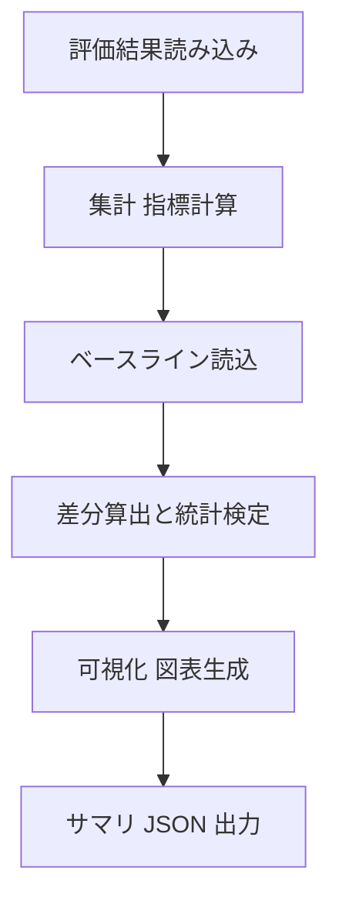

# 全体性能の確認・差分分析エージェント 仕様書（最新版）


この仕様書は、AI分析エンジンの「全体性能の確認・差分分析エージェント（パフォーマンスアナライザ）」の詳細仕様を示します。評価データセット全体の指標を集計し、前回実行やベースラインと比較して差分・トレンド・回帰の有無を判定し、図表を生成します。

---

## 目次
- [全体性能の確認・差分分析エージェント 仕様書（最新版）](#全体性能の確認差分分析エージェント-仕様書最新版)
  - [目次](#目次)
  - [1. システム概要](#1-システム概要)
    - [1.1 目的](#11-目的)
    - [1.2 指標](#12-指標)
  - [2. 処理の流れ](#2-処理の流れ)
  - [3. 入力と出力](#3-入力と出力)
    - [入力](#入力)
    - [出力](#出力)
  - [4. 主要コンポーネント](#4-主要コンポーネント)
    - [4.1 コンポーネント一覧](#41-コンポーネント一覧)
    - [4.2 使用技術](#42-使用技術)
    - [4.3 成果物出力先](#43-成果物出力先)
  - [5. 機能の詳細](#5-機能の詳細)
    - [5.1 指標計算](#51-指標計算)
    - [5.4 可視化](#54-可視化)
    - [5.5 出力](#55-出力)
    - [5.6 ロギング](#56-ロギング)
  - [6. システムの動かし方](#6-システムの動かし方)
  - [7. サンプルコード](#7-サンプルコード)
  - [8. まとめ](#8-まとめ)
  - [9. 開発ロードマップ](#9-開発ロードマップ)

---

## 1. システム概要

### 1.1 目的
評価結果の集計、ベースライン比較、差分の可視化、統計的有意性の判定を自動化します。

### 1.2 指標
- 正解率[%]・過検知数[回/h]

---

## 2. 処理の流れ



---

## 3. 入力と出力

### 入力
- 評価結果: DBに記載のパスからcsv,jsonを読み込み、評価結果を取得
- ベースライン: 過去の集計 JSON または複数ランのフォルダ
- 設定: 指標の閾値、グラフのスタイル、集計粒度

### 出力
- 集計・差分結果 MD: `summary_reports.md`
- 集計・差分結果 JSON: `summary_reports.json`
- 図表（静的画像）: `reports/charts/`（時系列、混同行列、ROC/PR、誤差ヒートマップ、散布図など。 summary_reports.mdにリンクを貼る）


---

## 4. 主要コンポーネント
### 4.1 コンポーネント一覧
- 集計モジュール: 指標計算（正解率、過検知数 等）
- ベースライン比較モジュール: 前回/指定ベースラインとの比較、差分・回帰検知
- 統計検定モジュール: 有意差判定（例: 比率の差の検定、t検定 等）
- 可視化モジュール: 図表生成（静的画像: jpg/png）
- エクスポートモジュール: Markdown・JSON・画像の出力

### 4.2 使用技術
- データ処理: pandas, numpy
- 可視化: matplotlib, seaborn, plotly（静的画像エクスポート）
- 出力形式: Markdown + 静的画像（既定）

### 4.3 成果物出力先
- レポート: `reports/summary/summary_reports.md`
- 図表: `reports/charts/`
- データ: `reports/summary/summary_reports.json`

---

## 5. 機能の詳細
### 5.1 指標計算
- 入力データから対象指標を計算（例: 正解率 = 正解数/全件、過検知数 = 単位時間あたりの過検知件数）

### 5.4 可視化
- 既定は静的画像（jpg/png）。インタラクティブは必要時のみ（任意）

### 5.5 出力
- Markdown: 主要結果のサマリ、図表へのリンク
- JSON: 集計値/差分/有意性結果を構造化出力

### 5.6 ロギング
- 実行設定、入力データ範囲、集計結果サマリ、エラー情報を構造化ログで保存

---

## 6. システムの動かし方
1. 評価結果・ベースラインの場所を設定
2. 指標・集計粒度・可視化オプションを設定
3. 実行し、`summary_reports.md` と `reports/charts/` を確認

---

## 7. サンプルコード
```python
import pandas as pd
import json

def compute_metrics(df: pd.DataFrame) -> dict:
    total = len(df)
    correct = (df["label"] == df["pred"]).sum()
    accuracy = correct / total if total else 0.0
    return {"accuracy": accuracy}

def diff_against_baseline(cur: dict, base: dict) -> dict:
    return {
        k: {"current": cur.get(k), "baseline": base.get(k), "diff": (cur.get(k, 0)-base.get(k, 0))}
        for k in cur.keys() | base.keys()
    }

if __name__ == "__main__":
    df = pd.read_csv("eval.csv")
    cur = compute_metrics(df)
    base = json.load(open("baseline.json", "r", encoding="utf-8"))
    result = diff_against_baseline(cur, base)
    with open("reports/summary/summary_reports.json", "w", encoding="utf-8") as f:
        json.dump({"metrics": cur, "baseline_diff": result}, f, ensure_ascii=False, indent=2)
```

---

## 8. まとめ
全体性能差分分析エージェントは、評価結果の集計・差分・有意性を自動化し、Markdown+静的画像で成果物を出力します。

---

## 9. 開発ロードマップ
1. 指標計算コアの実装（accuracy ほか最小セット）
2. ベースライン比較と差分出力
3. 可視化（時系列/ヒートマップ）
4. 設定・成果物パスの統一とテスト
