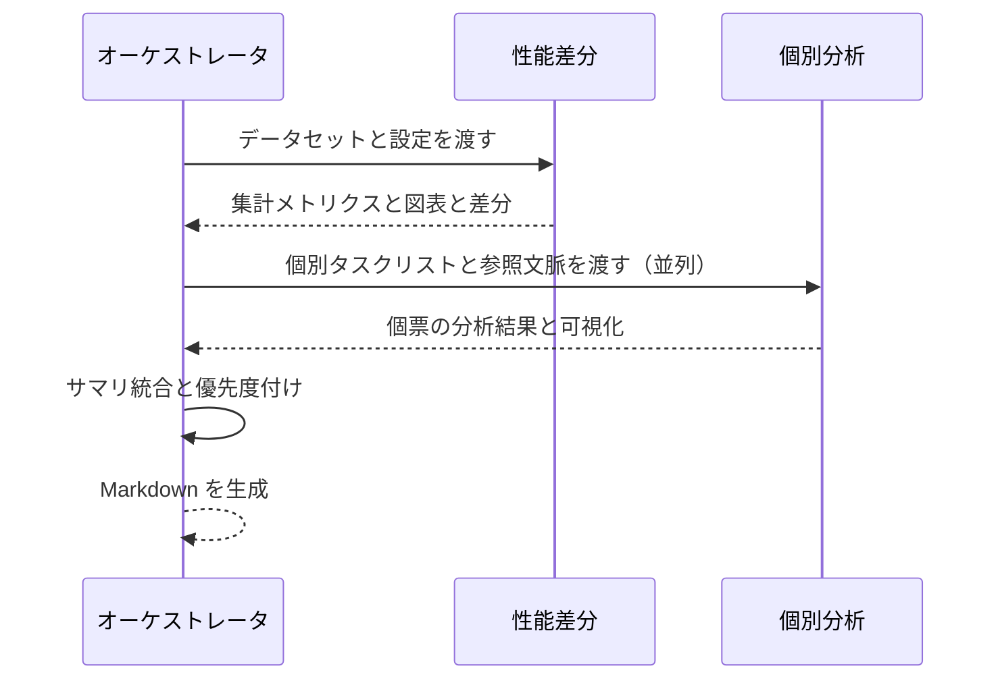

# 制御・最終レポートエージェント 仕様書（最新版）


この仕様書は、AI分析エンジンの「制御・最終レポートエージェント（オーケストレータ）」の詳細仕様を示します。エージェントは「全体性能の確認・差分分析エージェント」「個別データ分析エージェント」を統括し、実行順序・入出力連携・失敗時リトライ・要約・最終レポート生成を担います。

---

## 目次
1. [システム概要](#1-システム概要)
2. [処理の流れ](#2-処理の流れ)
3. [入力と出力](#3-入力と出力)
4. [主要コンポーネント](#4-主要コンポーネント)
5. [機能の詳細](#5-機能の詳細)
6. [システムの動かし方](#6-システムの動かし方)
7. [サンプルコード](#7-サンプルコード)
8. [まとめ](#8-まとめ)
9. [開発ロードマップ](#9-開発ロードマップ)

---

## 1. システム概要

### 1.1 目的
複数エージェントの実行を統括し、結果を統合して Markdown の最終レポートを生成します。各ステップの例外処理、再試行、並列化、優先度付け、成果物管理を一元化します。

### 1.2 役割
- 実行順序の管理（性能→個別の順で実行、個別は並列化）
- 入出力の連携（成果物の受け渡し、メタ情報の付帯）
- 失敗時リトライとフォールバック（上限回数、バックオフ）
- 要約と優先度付け（課題の重み計算）
- Markdown の最終レポート生成

---

## 2. 処理の流れ

### 2.1 高レベルフロー


### 2.2 詳細ステップ
1. 設定の読み込み（実行モード、並列度、リトライ設定、しきい値）
2. 性能差分エージェントを実行し、集計 JSON と図表を取得
3. 個別分析エージェントに「課題タスクリスト」を配布（並列スケジューリング）
4. 成果物を収集・正規化し、優先度を計算
5. Markdown テンプレートへ埋め込み、最終レポートを出力

---

## 3. 入力と出力

### 入力
- データ: 評価結果の CSV/DB、メタ情報（被験者、日時、環境）
- ベースライン: 過去の集計 JSON やランID
- 設定: 並列度、最大リトライ回数、優先度重み、しきい値、テンプレートパス
- 参照: 仕様書、ソースコード、期待値（RAG 用）

### 出力
- 最終レポート（Markdown）: `reports/analysis_report_YYYYMMDD_HHMMSS.md`
- 図表（静的画像）: `reports/charts/` 配下（時系列、混同行列、ROC、PR、誤差ヒートマップ など）
- データ: `reports/data/analysis_summary.json` `reports/data/improvement_suggestions.json` `reports/data/diff_summary.json`
- ログ: 実行ログ、失敗リトライ履歴、各エージェントの出力要約

---

## 4. 主要コンポーネント
- orchestrator.py: 実行順序・並列スケジューリング・リトライ・成果物統合
- final_report.py: Markdown の最終生成
- scheduler: 並列実行とジョブ監視
- retry_manager: 失敗時の再試行、バックオフ制御
- artifact_registry: 図表・JSON の参照管理
- templates/: Markdown のテンプレート

---

## 5. 機能の詳細

### 5.1 並列スケジューリング
- 個別分析のタスクをフレームまたはケース単位で分割し、並列度上限を尊重して配布
- 失敗タスクは指数バックオフで再試行（例: 3回）

### 5.2 優先度付け
- 重み付きスコア: 影響範囲、発生頻度、差分量、再現性、重要カテゴリ
- ランキング上位から改善提案に反映

### 5.3 成果物統合
- 性能差分のトレンドと個別事例を関連付け（例: クラス単位の回帰と具体例）
- Notebook セルと HTML セクションに自動整形して配置

### 5.4 レポート生成
- Markdown: Jinja2 でテンプレートを適用し、図表（静的画像）へのリンクを埋め込み

---

### 5.5 設定項目（YAML例）

```yaml
parallelism: 4
retry:
  max_attempts: 3
  backoff_sec: 5
paths:
  output_root: reports/
  templates:
    notebook: templates/notebook_template.ipynb
    html: templates/html_template.html
priority_weights:
  impact: 0.4
  frequency: 0.3
  delta: 0.2
  reproducibility: 0.1
```

### 5.6 オーケストレータ API（抽象）

```
POST /orchestrator/run
Request JSON:
{
  "run_id": "string",
  "evaluation_data": { "path": "DataWareHouse/04_evaluation_output/..." },
  "baseline": { "summary_json": ".../prev_summary.json" },
  "instance_tasks": [ { "data_path": ".../case1.csv", "expectations": ["..."] } ],
  "options": { "parallelism": 4, "retry": {"max_attempts": 3} }
}

Response JSON:
{
  "run_id": "string",
  "status": "success" | "partial" | "failed",
  "artifacts": {
    "markdown": "reports/analysis_report_YYYYMMDD_HHMMSS.md",
    "charts_dir": "reports/charts/",
    "data_dir": "reports/data/"
  },
  "logs": "reports/data/orchestrator_logs.jsonl"
}
```

### 5.7 アーティファクト仕様

- Notebook: 実行概要、性能差分、個別事例、改善提案サマリの順でセクション構成
- HTML: 上記と同等のセクション、静的画像/埋め込みチャートをサポート
- data/: `analysis_summary.json`, `diff_summary.json`, `improvement_suggestions.json`

### 5.8 ログと監視

- すべてのサブジョブの開始/終了、所要時間、失敗理由をJSON Linesで記録
- メトリクス: 失敗率、平均所要時間、再試行回数、並列度実効値

### 5.9 エラーコード

- ORCH-SCHEDULE-ERROR: スケジューリング失敗
- ORCH-RETRY-EXCEEDED: 再試行上限到達
- ORCH-TEMPLATE-ERROR: レポートテンプレート適用失敗

## 6. システムの動かし方
1. 設定ファイルを準備（並列度、しきい値、テンプレート）
2. オーケストレータを起動し、データパスとベースラインを指定
3. 完了後、`reports/` 配下の Markdown と画像を確認

---

## 7. サンプルコード
```python
from ai_analysis_engine import Orchestrator

orchestrator = Orchestrator(
    parallelism=4,
    retry_max_attempts=3,
    baseline_path="reports/data/prev_summary.json",
    markdown_template="templates/report.md.j2",
)

orchestrator.run(
    evaluation_data_path="datasets/eval.csv",
    spec_path="projects/spec.md",
    code_root="src/",
    output_dir="reports/",
)
```

---

## 8. まとめ
並列化・リトライ・成果物統合・最終レポート生成を一元化し、安定した運用と再現性の高い出力を保証します。

---

## 9. 開発ロードマップ
1. 並列スケジューラとリトライ基盤
2. 成果物レジストリと参照整合性チェック
3. Markdown テンプレート整備
4. 優先度スコアリングのチューニング
5. CI での自動生成テスト


