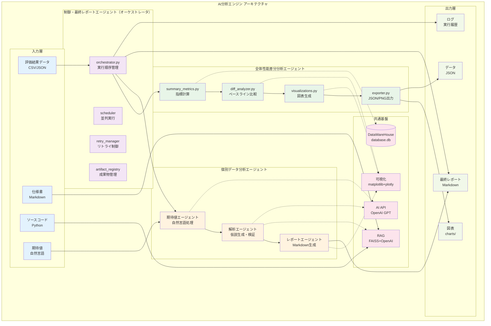
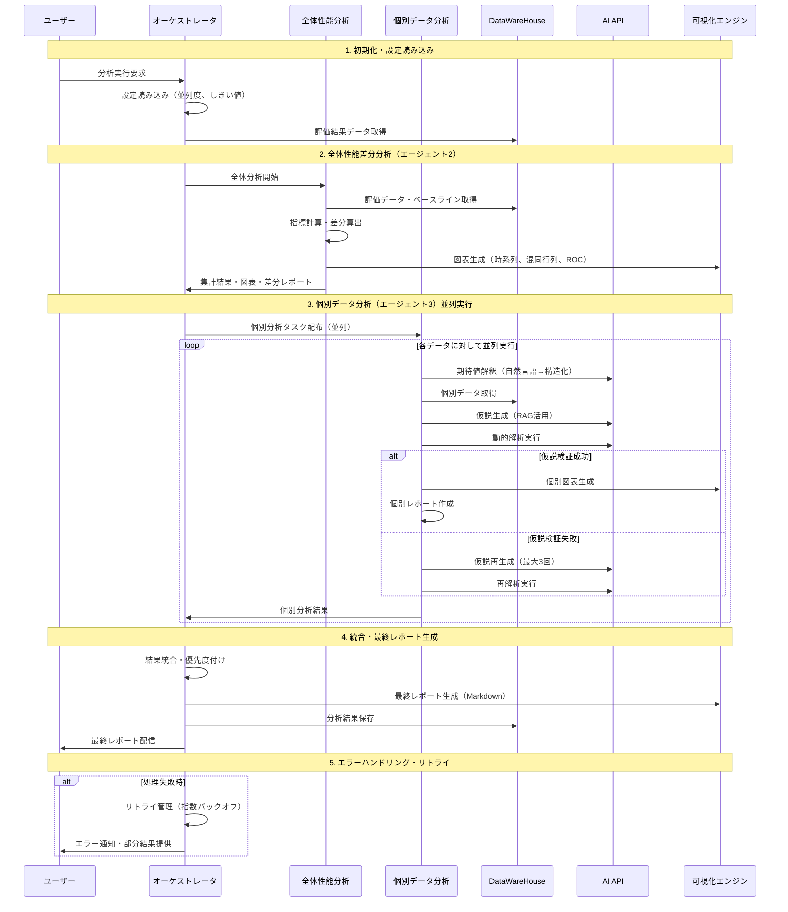
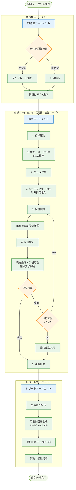

# AI分析エンジン設計書


## 📋 概要

AI分析エンジンは、アルゴリズム評価結果を自動分析し分析レポートを生成するシステムです。

本エンジンは次の3つのエージェントの組み合わせで構成されます。

1. 制御・最終レポートエージェント（オーケストレータ）
   - エージェント2/3を統括し、実行順序・入出力・失敗時リトライ・要約を管理
   - 最終的な統合レポート（Markdown）の生成・体裁調整・確認

2. 全体性能の確認・差分分析エージェント（パフォーマンスアナライザ）
   - 評価データセット全体の正解率・過検知率・未検知率・速度などを集計
   - 前回実行やベースラインとの比較（差分）を可視化し、傾向・回帰の有無を判定

3. 個別データの分析エージェント（インスタンスアナライザ）
   - 課題データ（個票）ごとの詳細分析を実施
   - 仕様書・ソースコード・期待値を参照しつつ、仮説→検証→ループバックで原因特定を支援

## 🎯 機能要件

### 主要機能
1. **自動評価結果分析**
2. **レポート**
3. **課題の優先度付け**
4. **全体性能差分レポート**（エージェント2）
5. **個別データ詳細レポート**（エージェント3）

### レポート構成
1. **サマリセクション**
   - 全体評価スコア（データセット全体の正解率、過検知数(未実装)）
   - 主要課題の要約
   - 改善優先度ランキング
   - 推奨アクション

2. **個別分析結果**
   - 時系列分析結果（対象データの時系列グラフ（閾値や、検知フレームにマークを追加するなどわかりやすい図を生成））
   - エラー分析結果（誤検知・未検知の原因を特定）


## 🏗️ 技術仕様

### 使用技術
- **AI API**: OpenAI GPT
- **データ処理**: Python + pandas + numpy
- **可視化**: matplotlib + seaborn + plotly
- **データ管理**: データセットはDataWareHouseで管理
- **データ分析**: データ分析はlangchainを使用。必要なツール類は詳細仕様で定義。
- **レポート形式**: マークダウン+jpgによる図


### システム構成



### データセット・出力の保管ポリシー
- 本プロジェクトで扱うデータセットおよび各エンジンの出力は、`database.db` を基準とした相対パスで一元管理します。
- 評価・分析・可視化で生成される成果物（CSV/JSON/md/HTML 等）も、原則 `(database.dbの格納ディレクトリ)/05_analysis_output/` 配下に相対パスで保存します。


## 🔄 処理フロー

1. **評価結果データ読み込み**
2. **全体性能の確認・差分分析（エージェント2）**
3. **個別データの詳細分析（エージェント3）**
4. **全体性能中間レポート生成**
5. **個別データ中間レポート生成**
6. **最終レポートにまとめて統合出力**



---

## 3. 個別データの分析エージェント（詳細仕様）

本章の詳細仕様はボリュームが大きいため、専用ドキュメントに分離。

- 参照: `projects/詳細設計資料/AI分析エンジン/個別データ分析エージェント仕様.md`
- 参照: `projects/詳細設計資料/AI分析エンジン/制御・最終レポートエージェント仕様.md`
- 参照: `projects/詳細設計資料/AI分析エンジン/全体性能差分分析エージェント仕様.md`

### 3.1 目的と特徴
- 自然言語の期待値・仕様書・ソースコードを参照し、個票データの異常箇所を特定
- 仮説→検証→ループバックの自律サイクルで原因特定を支援（最大試行回数を設定）
- 解析は AI を用いた動的コード生成で実施し、根拠を出力

### 3.2 入力
- データ: アルゴリズムの出力結果が記載された時系列のCSV （例: `frame`, `predict_result` など）
- データ: アルゴリズムの入力データが記載された時系列のCSV （例: `frame`, `input_data` など）
- 仕様書: Markdown（アルゴリズム仕様）
- ソースコード: Python 等（必要に応じて AST 解析）
- 期待値: 自然言語（テンプレート＋LLM で構造化 JSON に変換）（未実装）

### 3.3 出力
- 個別レポート（解析データ１つにつき１つのマークダウンファイル）
  - 異常箇所（場所・検出値・期待値・差分）
  - 仮説（例: 条件分岐ミス、パラメータ不整合、データ不備）
  - 可視化（jpgによる図をマークダウンにリンク）

### 3.4 処理の流れ



---

## 📈 出力例

### レポートファイル構成
```
[analysis_ID]_[date]/
├── analysis_report_YYYYMMDD_HHMMSS.md
├── data1_[data_ID].md
├── data2_[data_ID].md
├── ...
├── images/
│   ├── time_series.jpg
│   ├── confusion_matrix.jpg
│   ├── roc_curve.jpg
│   └── error_heatmap.jpg
└── data/
    ├── analysis_summary.json
    └── improvement_suggestions.json
```


### サマリレポート出力サンプル
```markdown
# 分析サマリー

## 実行概要
- **分析日時**: 2025-07-25 14:30:00
- **対象アルゴリズム**: eye_detection
- **アルゴリズムバージョン**: v1.0
- **評価回数**: 20回（4人×5回）
- **比較対象**: v0.9

## 主要結果
- **正解率**: 85.2% (前回比 +5.3%))
- **過検知数**: xx回/h (前回比 -0.2回/h)

## 主要課題
| 課題 | 原因 | 詳細 |
|------|------|------|
| 過検知数が多い | 閾値設定が不適切 | 眼の閉じ具合の判定閾値が低すぎるため、軽微な瞬きも居眠りとして検出 |
| 検出遅延が発生 | フレーム処理の遅延 | 連続フレーム解析時のバッファリング処理が重く、リアルタイム性が低下 |
| 精度のばらつき | 環境光の影響 | 明暗差が大きい環境下で瞳孔検出精度が不安定 |


## 個別データ分析結果
(各個別データ分析結果のマークダウンファイルへのリンクを記載)


```

## 🔧 設定項目

### AI分析パラメータ
- 分析深度レベル（Basic/Standard/Detailed）
- 可視化の詳細度
- レポートの出力形式

### カスタマイズ項目
- 分析項目の追加・削除
- 可視化チャートのカスタマイズ
- レポートテンプレートの変更


## 📝 更新履歴

- **2025-07-25**: 初版作成（v1.0）
- **2025-08-08**: 3エージェント構成を定義し、個別データ分析エージェントの詳細仕様を統合（v1.1）
- **2025-08-17**: 3.6 入出力例を「フレーム x~y は項目 z が w であるべき」に基づく現実的ワークフローへ更新（v1.2）
- **2025-08-29**: システム構成図・処理フロー図を追加、改善提案を実装重視に整理して資料をv1.3に完成（v1.3）