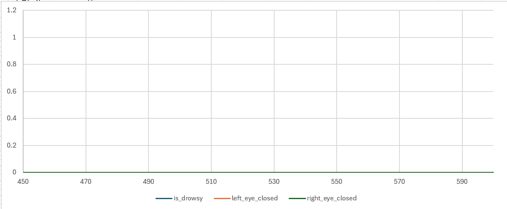
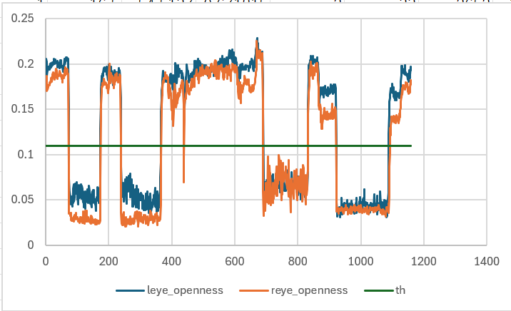

<!-- これは個別データ分析レポートのサンプルです。 -->
<!-- TODO:2_9を例に自分で分析レポートをまとめてみる -->

# 個別データ分析レポート（例） - task_2_9

## 概要

- 結論 : 被験者が閉眼していない。 or コアの検出機能に問題がある。　<!--結論は仮説検証にて確認した結果を記載-->
- 解析対象動画： [video002](..\ImproveAlgorithmDevelopment\DataWareHouse\01_mov_data\video002) <!-- video_tableから参照-->
- フレーム区間: 465-593 <!--tagから参照-->
- 期待値：連続閉眼あり <!--評価結果から取得-->
- 検知結果：連続閉眼なし <!--評価結果から取得-->

## 確認結果

アルゴリズム出力結果
<!--今回のケースでは"..\ImproveAlgorithmDevelopment\DataWareHouse\03_algorithm_output\v0.1.1+fa5172ba\20250826-155036\2.csv")の区間460~600における、is_drowsy	, left_eye_closed, right_eye_closedのグラフをpandasaiで生成しリンク--> 

コア出力結果
<!--video002に対応するcsv(今回のケースでは"..\ImproveAlgorithmDevelopment\DataWareHouse\02_core_lib_output\v1.0.0\2\WIN_20250819_10_12_55_Pro_analysis.csv")の区間460~600における、leye_openness, reye_openness	thと、仕様書から取得した開眼度閾値をプロットしたグラフをpandasaiで生成しリンク--> 

<!--上記のグラフを生成後、閉眼傾向があるかを仮説検証にて確認し、結果をいかに記載-->
- 入出力の確認結果：task中のreye_opennessとleye_opennessが0.2程度になっており、閉眼傾向が見られない。

- 考えられる原因1 : 被験者が閉眼していない。
- 考えられる原因2 : 被験者が正しく閉眼しているが、コアの検出機能に問題がある。

## 推奨事項

- 被験者のタスク不正により正しく閉眼していない可能性があります。まずは動画を確認してください。もし閉眼をしている場合は、コアの検出機能に問題がある可能性があります。

## 参照した仕様/コード（抜粋）
... <!-- 仮説検証にて参照した仕様/コードを記載-->

