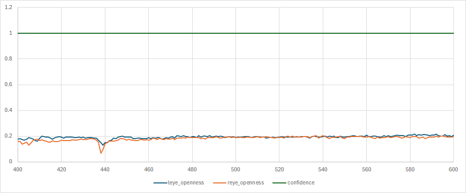

<!-- これは個別データ分析レポートのサンプルです。 -->
<!-- TODO:2_9を例に自分で分析レポートをまとめてみる -->

# 個別データ分析レポート（例） - task_2_9

## 概要
- 解析対象動画： [video002](..\ImproveAlgorithmDevelopment\DataWareHouse\01_mov_data\video002) (video_idから参照)
- フレーム区間: 465-593 (tagから参照)
- 期待値：連続閉眼あり
- 検知結果：連続閉眼なし
- 図表: (chart_pathからリンク参照)

## 確認結果
- 入出力の確認結果：task中のreye_opennessとleye_opennessが0.2程度になっており、閉眼傾向が見られない。
  
- 考えられる原因: 被験者が閉眼していない。
- 検証結果: 有効

## 推奨事項

- 被験者のタスク不正により正しく閉眼していない可能性があります。動画を確認してください。

## 参照した仕様/コード（抜粋）
...

