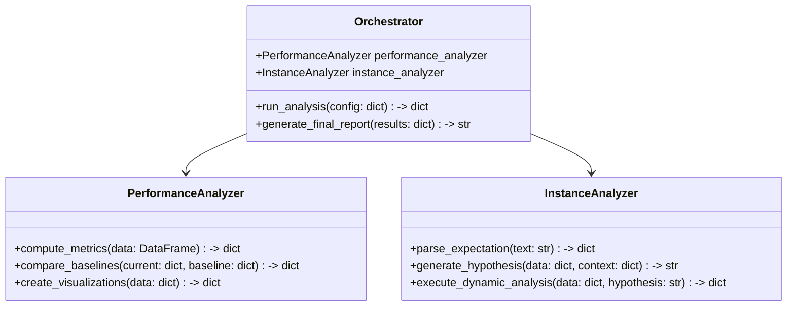
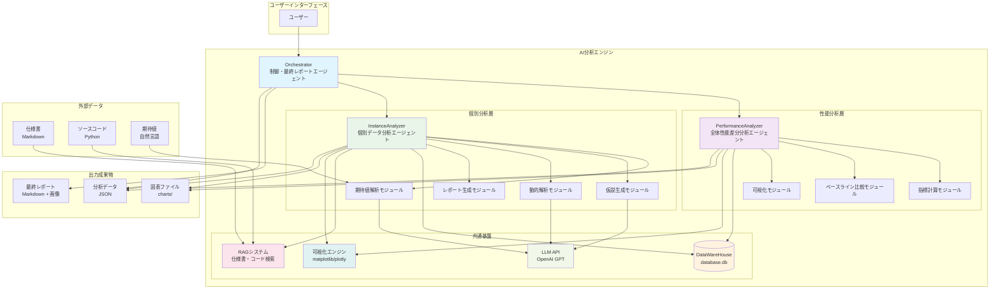

# AI分析エンジン詳細設計仕様書

## 概要
この仕様書は、AI分析エンジンの詳細設計を定義します。3つのエージェント（制御・最終レポート、全体性能差分分析、個別データ分析）をクラス化し、一つのシステム内で動作させます。

## アーキテクチャ

### クラス図


### システム構成図


## プロジェクトファイル構造

```
ai_analysis_engine/
├── src/
│   ├── __init__.py
│   ├── orchestrator.py              # Orchestratorクラス
│   ├── performance_analyzer.py       # PerformanceAnalyzerクラス
│   ├── instance_analyzer.py          # InstanceAnalyzerクラス
│   ├── utils/
│   │   ├── __init__.py
│   │   ├── data_loader.py            # データ読み込みユーティリティ
│   │   ├── visualization.py          # 可視化ユーティリティ
│   │   └── rag_system.py             # RAGシステムユーティリティ
│   └── config/
│       ├── __init__.py
│       └── settings.py                # 設定管理
├── templates/
│   ├── report_template.md.j2         # レポートテンプレート
│   ├── instance_report_template.md.j2 # 個別レポートテンプレート
│   └── email_template.html.j2        # メール通知テンプレート
├── config/
│   ├── default_config.yaml           # デフォルト設定
│   ├── production_config.yaml        # 本番環境設定
│   └── development_config.yaml       # 開発環境設定
├── tests/
│   ├── __init__.py
│   ├── test_orchestrator.py          # Orchestratorテスト
│   ├── test_performance_analyzer.py  # PerformanceAnalyzerテスト
│   ├── test_instance_analyzer.py     # InstanceAnalyzerテスト
│   ├── test_integration.py           # 統合テスト
│   └── fixtures/
│       ├── sample_data.csv           # テスト用サンプルデータ
│       ├── spec_sample.md            # テスト用仕様書
│       └── code_sample.py            # テスト用ソースコード
├── docs/
│   ├── api_reference.md              # APIリファレンス
│   ├── user_guide.md                 # ユーザーガイド
│   ├── developer_guide.md            # 開発者ガイド
│   └── changelog.md                  # 変更履歴
├── examples/
│   ├── basic_usage.py                # 基本使用例
│   ├── advanced_usage.py             # 高度な使用例
│   └── custom_agent.py               # カスタムエージェント例
├── scripts/
│   ├── setup.py                      # セットアップスクリプト
│   ├── run_analysis.py               # 分析実行スクリプト
│   └── generate_report.py            # レポート生成スクリプト
├── logs/                             # 実行ログ出力先
│   └── analysis_YYYYMMDD_HHMMSS.log
├── outputs/                          # 分析結果出力先
│   ├── reports/                      # 最終レポート
│   │   ├── analysis_report_YYYYMMDD_HHMMSS.md
│   │   └── instance_reports/
│   ├── charts/                       # 図表ファイル
│   │   ├── time_series.png
│   │   ├── confusion_matrix.png
│   │   └── performance_comparison.png
│   └── data/                         # 分析データ
│       ├── analysis_summary.json
│       ├── performance_metrics.json
│       └── improvement_suggestions.json
├── .venv/                            # 仮想環境（.gitignore対象）
├── _input/                           # 入力仕様書等
├── pyproject.toml                    # プロジェクト設定
├── requirements.txt                  # 依存関係
├── .gitignore                        # Git除外設定
├── README.md                         # プロジェクト概要
├── LICENSE                           # ライセンス
└── log.md                            # 開発ログ
```

## 各エージェントの詳細設計

### 1. Orchestrator (制御・最終レポートエージェント)
- **役割**: 全体の実行統制、最終レポート生成
- **主なメソッド**:
  - `__init__(self, performance_analyzer, instance_analyzer)`
  - `run_performance_analysis(self, data_path: str, baseline_path: str) -> dict`
  - `run_instance_analysis(self, data_path: str, expectations: list, context: dict) -> dict`
  - `integrate_results(self, performance_results: dict, instance_results: list) -> dict`
  - `generate_report(self, integrated_results: dict) -> str`

### 2. PerformanceAnalyzer (全体性能差分分析エージェント)
- **役割**: データセット全体の指標計算、差分分析、可視化
- **主なメソッド**:
  - `load_data(self, path: str) -> DataFrame`
  - `compute_metrics(self, df: DataFrame) -> dict`
  - `compare_with_baseline(self, current: dict, baseline: dict) -> dict`
  - `create_charts(self, metrics: dict) -> dict`
  - `export_results(self, results: dict, output_dir: str) -> None`

### 3. InstanceAnalyzer (個別データ分析エージェント)
- **役割**: 個別データの詳細分析、仮説生成・検証
- **主なメソッド**:
  - `parse_expectation(self, expectation_text: str) -> dict`
  - `analyze_data(self, data: dict, expectation: dict) -> dict`
  - `generate_hypothesis(self, analysis_results: dict, context: dict) -> str`
  - `verify_hypothesis(self, hypothesis: str, data: dict) -> dict`
  - `create_instance_report(self, results: dict) -> str`

## 技術スタック
- **Python**: 3.10+
- **データ処理**: pandas, numpy
- **AI/ML**: Pandas AI, LangChain, OpenAI GPT
- **可視化**: matplotlib, seaborn, plotly
- **テンプレート**: Jinja2
- **環境管理**: uv

## 依存関係
- pandasai>=3.0.0b19
- pandasai-openai>=0.1.6
- langchain-openai>=1.0.0a1
- matplotlib>=3.7.5
- seaborn>=0.12.2
- plotly>=6.3.0
- jinja2>=3.1.6

## 設定項目
```yaml
global:
  database_path: ../DataWareHouse/database.db
  datawarehouse_path: ../DataWareHouse/
  templates_path: ./templates/
orchestrator:
  max_parallel_instances: 4
  timeout_seconds: 900
performance_analyzer:
  metrics: [accuracy, over_detection_count_per_hour]
  visualization_level: standard
instance_analyzer:
  max_hypothesis_attempts: 3
  llm_model: gpt-4
  temperature: 0.1
  # drowsy_detectionアルゴリズムパラメータ
  drowsy_detection:
    left_eye_close_threshold: 0.10
    right_eye_close_threshold: 0.10
    continuous_close_time: 1.00  # 秒
    face_conf_threshold: 0.75
```

## DataWareHouse連携仕様

### 期待値の生成方法
- **外部入力不要**: 期待値は評価結果から内部推察により生成
- **drowsy_detectionアルゴリズム仕様に基づく**:
  - 左右目の開眼度が閾値(0.10)以下かつ顔検出信頼度が0.75以上の場合
  - 連続閉眼時間が1.00秒以上の場合、`is_drowsy = 1`となるべき
  - それ以外の場合は`is_drowsy = 0`となるべき
- **動的期待値生成**: 各フレームの入力データから期待出力を算出

### 成果物格納仕様
- **格納先**: `../DataWareHouse/05_analysis_output/`
- **データベース登録**: `database.db`の`algorithm_output_table`に登録
- **ディレクトリ構造**:
  ```
  05_analysis_output/
  ├── analysis_reports/
  │   ├── analysis_report_YYYYMMDD_HHMMSS.md
  │   └── instance_reports/
  ├── charts/
  │   ├── time_series.png
  │   ├── confusion_matrix.png
  │   └── performance_comparison.png
  └── data/
      ├── analysis_summary.json
      ├── performance_metrics.json
      └── improvement_suggestions.json
  ```

### データベース連携API
- **使用APIモジュール**:
  - `algorithm_api.py`: アルゴリズム出力管理（get_algorithm_output, list_algorithm_outputs, get_latest_algorithm_version）
  - `analysis_api.py`: 分析結果・問題点管理（create_analysis_result, create_problem, create_analysis_data）
  - `evaluation_api.py`: 評価データ管理（評価関連API）
- **トランザクション管理**: DataWareHouse APIのコンテキストマネージャーを使用した自動トランザクション制御
- **エラーハンドリング**: DataWareHouse固有の例外クラス（DWHError, DWHNotFoundError, DWHConstraintError）を使用

## 処理フロー
1. **初期化**: DataWareHouse接続と設定読み込み
2. **評価データ取得**: `algorithm_output_table`から評価結果を取得
3. **期待値生成**: drowsy_detectionアルゴリズム仕様に基づき期待値を内部生成
4. **性能分析**: PerformanceAnalyzerで全体評価を実行
5. **個別分析**: InstanceAnalyzerで各インスタンスを並列分析
6. **成果物格納**: 分析結果をDataWareHouseに格納し、DBに登録
7. **レポート生成**: 最終レポートを作成

## エラーハンドリング
- 各エージェントで例外をcatchし、ロギング
- タイムアウト時は部分結果を返却
- 依存関係エラー時は代替処理を実行

## 拡張性
- プラグインアーキテクチャで新しい分析手法を追加可能
- 設定ファイルでパラメータを柔軟に変更可能
- ログ出力でデバッグ・監視を支援
