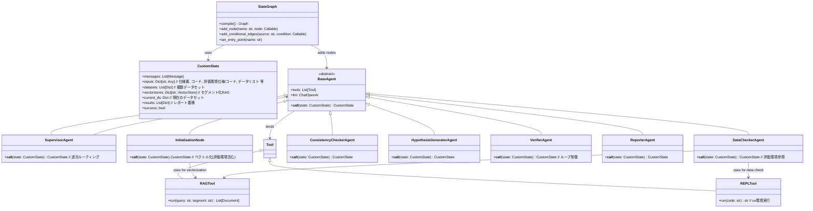
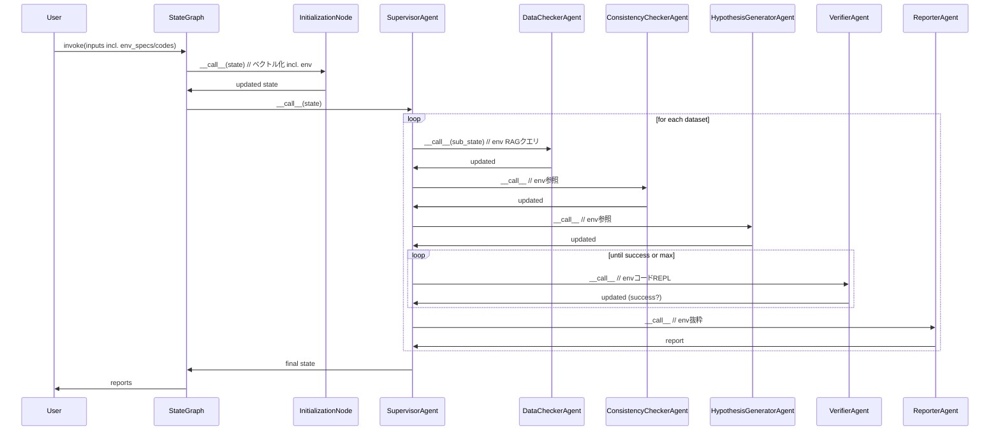

# 時系列処理アルゴリズムの課題分析システム 詳細設計書 (v3.0)

## 変更履歴
このセクションでは、詳細設計書のバージョン履歴を記載。変更は日付、バージョン、変更内容、理由を明記。

| 日付          | バージョン | 変更内容                                                                 | 理由/追加要求                                                                 |
|---------------|------------|--------------------------------------------------------------------------|-------------------------------------------------------------------------------|
| 2025-09-10   | v2.0      | 詳細設計書作成: クラス図、インターフェイス、モジュール詳細、シーケンス図等追加。 | ユーザー要求（実装に向けた詳細設計）。                                        |
| 2025-09-10   | v2.1      | 評価環境input（env_specs/env_codes）をCustomState/InitializationNode/DataChecker等に明示追加。RAG/REPLでの参照を強化。 | ユーザー指摘（評価環境input抜け）。                                           |
| 2025-09-11   | v3.0      | 変更履歴欄追加、全履歴まとめ。内容はv2.1を基に統合/確認。仕様書と詳細設計書を分離。 | ユーザー要求（変更履歴欄作成、仕様書と詳細設計書分離）。                      |

## 1. 概要
この詳細設計書は、仕様書(v3.0)に基づき、システムの実装に向けた詳細設計を定義する。全要求を統合して再作成。クラス構造、インターフェイス、モジュール間の相互作用を詳細に記述。実装言語はPythonとし、依存ライブラリとしてLangGraph (v0.1.x+)、LangChain (v0.2.x+)、OpenAI (LLM用)、FAISS (RAGベクトルストア用)、Pandas/Matplotlib (REPL用) を使用。

設計原則:
- **モジュール化**: 各エージェントを独立したクラスとして実装。LangGraphのStateGraphでノードとして組み込み。
- **状態管理**: MessagesStateを拡張したカスタムStateクラスを使用。複数データセットの逐次処理をサポート。
- **インターフェイス**: 各エージェントは`__call__`メソッドを実装（LangGraphノード対応）。ツールはLangChainのToolとして定義。
- **エラー処理**: 例外キャッチとログ出力。ループ制限（e.g., max_iterations=10）。
- **拡張性**: RAGセグメント化をメタデータで管理。REPLはuv環境を想定（仮想環境ツール）。
- **複数データ処理**: Supervisorが逐次ループでサブ状態を管理。

適用範囲: 仕様書通り。テスト環境: Python 3.10+、unittest/Pytestで検証。

## 2. 全体クラス図


- **説明**: 
  - `CustomState`: inputsに評価環境追加。
  - `InitializationNode`: 評価環境ドキュメントをセグメント化。
  - `DataCheckerAgent`: 評価環境をRAGでクエリ（列意味等）。
  - 関係: 継承（エージェント）、コンポジション（ツールバインド）、使用（状態）。

## 3. モジュール詳細
各モジュールをクラスとして設計。インターフェイスは入力/出力型、メソッドシグネチャで定義。擬似コードで実装例を示す。評価環境inputを明示的に扱う。

### 3.1 CustomState クラス
- **役割**: 共有状態管理。LangGraphのMessagesStateを継承・拡張。評価環境input追加。
- **インターフェイス**:
  - 属性:
    - `messages: List[BaseMessage]` (LangChainから継承: メッセージ履歴)。
    - `inputs: Dict[str, Any]` (入力データ: {'specs': List[str]  // アルゴリズム仕様書, 'codes': List[str]  // アルゴリズムコード, 'env_specs': List[str]  // 評価環境Markdown仕様書, 'env_codes': List[str]  // 評価環境Pythonコード, 'datasets': List[Dict[str, str]]  // データセットリスト 等})。
    - `vectorstores: Dict[str, VectorStore]` (RAGストア: key=segment e.g. 'algo_A', 'env_B')。
    - `current_ds: Dict[str, Any]` (現在のデータセット: {'output_csv': str, 'core_csv': str, 'expected': str})。
    - `results: List[Dict]` (レポート蓄積)。
    - `success: bool` (検証フラグ)。
    - `iteration: int` (ループカウンタ、default=0)。
  - メソッド:
    - `__init__(self, **kwargs)`: 初期化。inputsをセット（評価環境含む）。
    - `copy(self) -> CustomState`: サブ状態作成（複数データ用）。
    - `update(self, key: str, value: Any)`: 状態更新（e.g., results.append(report)）。
- **実装例**:
```python
from typing import List, Dict, Any
from langgraph.graph import MessagesState
from langchain_core.messages import BaseMessage

class CustomState(MessagesState):
    inputs: Dict[str, Any]  # 例: {'specs': ['algo_spec.md'], 'codes': ['algo.py'], 'env_specs': ['env_spec1.md', 'env_spec2.md'], 'env_codes': ['env_code.py'], 'datasets': [...]}
    vectorstores: Dict[str, 'VectorStore']
    datasets: List[Dict[str, Any]]
    current_ds: Dict[str, Any]
    results: List[Dict] = []
    success: bool = False
    iteration: int = 0

    def copy(self):
        return CustomState(**self.__dict__.copy())
```

### 3.2 BaseAgent 抽象クラス
- **役割**: 全エージェントの基底。LLMとツールをバインド。
- **インターフェイス**:
  - 属性:
    - `llm: ChatOpenAI` (LLMインスタンス)。
    - `tools: List[Tool]` (バインドツール)。
    - `prompt_template: str` (プロンプトテンプレート)。
  - メソッド:
    - `__init__(self, llm: ChatOpenAI, tools: List[Tool], prompt_template: str)`: 初期化。
    - `bind_tools(self) -> Runnable`: LLMにツールバインド（LangChainのbind_tools使用）。
    - `__call__(self, state: CustomState) -> CustomState`: 抽象メソッド。状態処理・更新。
- **実装例**:
```python
from abc import ABC, abstractmethod
from langchain_openai import ChatOpenAI
from langchain.tools import Tool
from langchain_core.runnables import Runnable

class BaseAgent(ABC):
    def __init__(self, llm: ChatOpenAI, tools: List[Tool], prompt_template: str):
        self.llm = llm
        self.tools = tools
        self.prompt_template = prompt_template

    def bind_tools(self) -> Runnable:
        return self.llm.bind_tools(self.tools)

    @abstractmethod
    def __call__(self, state: CustomState) -> CustomState:
        pass
```

### 3.3 InitializationNode クラス (Initialization Agent)
- **継承**: BaseAgent
- **役割**: RAG初期化。評価環境ドキュメントをベクトル化対象に追加。
- **インターフェイス**:
  - `__call__(state: CustomState) -> CustomState`: ベクトルストア存在チェック・作成（env_specs/env_codes含む）。state.vectorstores更新。
- **ツール**: なし。
- **プロンプト**: なし (非LLMベース)。
- **実装例**:
```python
from langchain.vectorstores import FAISS
from langchain.embeddings import OpenAIEmbeddings
from langchain.schema import Document
import os
import pickle

class InitializationNode(BaseAgent):
    def __init__(self, llm=None, tools=[], prompt_template=""):
        super().__init__(llm, tools, prompt_template)
        self.embeddings = OpenAIEmbeddings()

    def __call__(self, state: CustomState) -> CustomState:
        if not self._vectorstore_exists():
            docs = self._segment_documents(state.inputs)
            state.vectorstores = {}
            for seg, doc_list in docs.items():
                state.vectorstores[seg] = FAISS.from_documents(doc_list, self.embeddings)
            self._save_vectorstores(state.vectorstores)
        else:
            state.vectorstores = self._load_vectorstores()
        return state

    def _vectorstore_exists(self) -> bool:
        return os.path.exists('vectorstores.pickle')

    def _segment_documents(self, inputs: Dict) -> Dict[str, List[Document]]:
        segments = {}
        all_docs = inputs['specs'] + inputs['codes'] + inputs['env_specs'] + inputs['env_codes']
        for doc_path in all_docs:
            doc = self._load_document(doc_path)
            seg = self._determine_segment(doc)
            if seg not in segments:
                segments[seg] = []
            segments[seg].append(doc)
        return segments

    def _load_document(self, path: str) -> Document:
        from langchain.document_loaders import TextLoader
        loader = TextLoader(path)
        return loader.load()[0]

    def _determine_segment(self, doc: Document) -> str:
        return doc.metadata.get('type', 'default')

    def _save_vectorstores(self, stores: Dict):
        with open('vectorstores.pickle', 'wb') as f:
            pickle.dump(stores, f)

    def _load_vectorstores(self) -> Dict:
        with open('vectorstores.pickle', 'rb') as f:
            return pickle.load(f)
```

### 3.4 SupervisorAgent クラス
- **継承**: BaseAgent
- **役割**: ルーティング。複数データ逐次処理。
- **インターフェイス**:
  - `__call__(state: CustomState) -> CustomState`: データセットループ。サブ状態で各エージェント呼び出し。
- **ツール**: なし。
- **プロンプト**: "現在の状態: {state_summary}. 次ステップ決定: DataChecker/ConsistencyChecker/HypothesisGenerator/Verifier/Reporter/END."
- **実装例**:
```python
class SupervisorAgent(BaseAgent):
    def __call__(self, state: CustomState) -> CustomState:
        for ds in state.inputs.get('datasets', []):
            sub_state = state.copy()
            sub_state.current_ds = ds
            next_step = self._decide_next(sub_state)
            while next_step != 'END':
                sub_state = agent_map[next_step](sub_state)
                next_step = self._decide_next(sub_state)
            state.results.append(sub_state.results[-1])
        return state

    def _decide_next(self, state: CustomState) -> str:
        response = self.llm.invoke(self.prompt_template.format(state=state))
        return response.content
```

### 3.5 DataCheckerAgent クラス
- **継承**: BaseAgent
- **役割**: データ確認。評価環境をRAGでクエリ（列意味等）。
- **インターフェイス**:
  - `__call__(state: CustomState) -> CustomState`: REPLで概要/プロット、RAGで評価環境参照。state.messagesに結果追加。
- **ツール**: REPLTool, RAGTool。
- **プロンプト**: "評価環境仕様: {env_spec}. データ: {csv_paths}. 列詳細確認し、describe/info実行。対象区間プロット。"
- **実装例**:
```python
import pandas as pd
import matplotlib.pyplot as plt

class DataCheckerAgent(BaseAgent):
    def __call__(self, state: CustomState) -> CustomState:
        env_segment = 'env_segment'
        column_meanings = self.tools[0].run("CSV列の意味とコアライブラリ入力方法", env_segment)
        code = f"""
import pandas as pd
df_output = pd.read_csv('{state.current_ds['output_csv']}')
df_core = pd.read_csv('{state.current_ds['core_csv']}')
summary_output = df_output.describe().to_string()
summary_core = df_core.describe().to_string()
"""
        repl_result = self.tools[1].run(code)
        plot_code = f"""
plt.plot(df_output['timestamp'], df_output['value'])
plt.savefig('algo_plot.png')
plt.plot(df_core['timestamp'], df_core['value'])
plt.savefig('core_plot.png')
"""
        self.tools[1].run(plot_code)
        state.messages.append(SystemMessage(content=f"確認結果: {column_meanings} {repl_result}"))
        return state
```

### 3.6 ConsistencyCheckerAgent クラス
- **継承**: BaseAgent
- **役割**: 整合性調査。評価環境を参照。
- **インターフェイス**: `__call__(state: CustomState) -> CustomState`: 期待値解析・比較。
- **ツール**: REPLTool, RAGTool。
- **プロンプト**: "期待: {expected}. 出力: {output}. 評価環境: {env_info}. 整合調査。"
- **実装例**: 類似 (RAGでenv_segmentクエリ、REPLでdf.query)。

### 3.7 HypothesisGeneratorAgent クラス
- **継承**: BaseAgent
- **役割**: 仮説生成。評価環境をRAGで参照。
- **インターフェイス**: `__call__(state: CustomState) -> CustomState`: JSON仮説リスト生成。
- **ツール**: RAGTool。
- **プロンプト**: "不整合: {issues}. 評価環境: {env_info}. 仮説生成: 不整合/パラメータ/想定外。"
- **実装例**: LLMでリスト生成、RAGクエリ追加、state.update('hypotheses', list)。

### 3.8 VerifierAgent クラス
- **継承**: BaseAgent
- **役割**: 検証ループ。評価環境コードをREPLでテスト可能。
- **インターフェイス**: `__call__(state: CustomState) -> CustomState`: 仮説テスト、iteration++、successセット。
- **ツール**: REPLTool, RAGTool。
- **プロンプト**: "仮説: {hypo}. 評価環境: {env_info}. REPLで検証。"
- **実装例**:
<xaiArtifact artifact_id="fa9704f9-a4fe-40be-84e3-74b6e471a8f3" artifact_version_id="da37c5b6-4a1a-4862-affa-7c7059d529f4" title="verifier_agent.py" contentType="text/python">
class VerifierAgent(BaseAgent):
    def __call__(self, state: CustomState) -> CustomState:
        if state.iteration > 10:
            state.success = False
            return state
        env_info = self.tools[1].run("コア入力方法とCSV仕様", 'env_segment')
        test_code = f"""
from {state.inputs['env_codes'][0].split('.')[0]} import eval_func
df = pd.read_csv('{state.current_ds['output_csv']}')
result = eval_func(df)
"""
        repl_result = self.tools[0].run(test_code)
        state.success = ('True' in repl_result)
        state.iteration += 1
        return state
</xaiArtifact>

### 3.9 ReporterAgent クラス
- **継承**: BaseAgent
- **役割**: レポート生成。
- **インターフェイス**: `__call__(state: CustomState) -> CustomState`: Markdownテンプレート埋め込み。
- **ツール**: REPLTool (図生成)。
- **プロンプト**: "状態まとめ、レポートフォーマットに従う。評価環境参照: {env_info}。"
- **実装例**: template.format(...) + mermaid図。RAGでenv抜粋。

### 3.10 ツールクラス
#### 3.10.1 RAGTool
- **継承**: Tool
- **インターフェイス**:
  - `run(self, query: str, segment: str) -> List[Document]`: セグメント検索（env_segment対応）。
- **実装例**: 前版通り。

#### 3.10.2 REPLTool
- **継承**: Tool (LangChainのPythonREPLTool拡張)
- **インターフェイス**:
  - `run(self, code: str) -> str`: uv環境でコード実行（評価環境コードimport対応）。
- **実装例**: exec in uv venv、出力キャプチャ。

## 4. シーケンス図 (全体フロー)


## 5. データモデル
- **入力JSON例**: {'specs': ['algo_spec.md'], 'codes': ['algo.py'], 'env_specs': ['env_spec1.md', 'env_spec2.md'], 'env_codes': ['env_eval.py'], 'datasets': [{'output_csv': 'out1.csv', 'core_csv': 'core1.csv', 'expected': 'フレーム1-10にz=1'}]}
- **レポート出力**: Markdownファイル/文字列リスト。

## 6. 実装ガイドライン
- **ビルド**: graph = StateGraph(CustomState); graph.add_node('init', InitializationNode(...)); ... ; graph.compile(checkpointer=MemorySaver())
- **実行**: graph.invoke(CustomState(inputs=...))
- **テスト**: モックツール/状態でユニットテスト（評価環境モック追加）。E2Eで複数データ+環境検証。
- **パフォーマンス**: 逐次処理のため、データセット数に応じて時間線形増加。

## 7. 追加の疑問点
なし。仕様書と整合。全要求統合。追加時再作成可能。