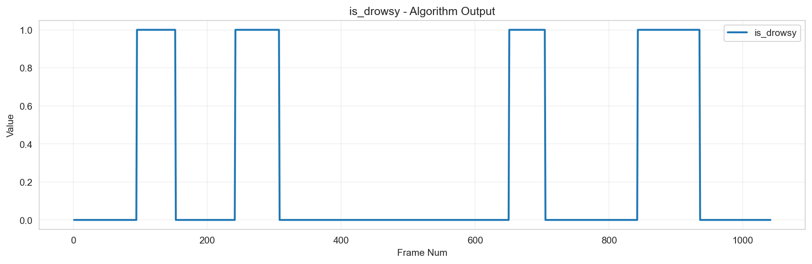
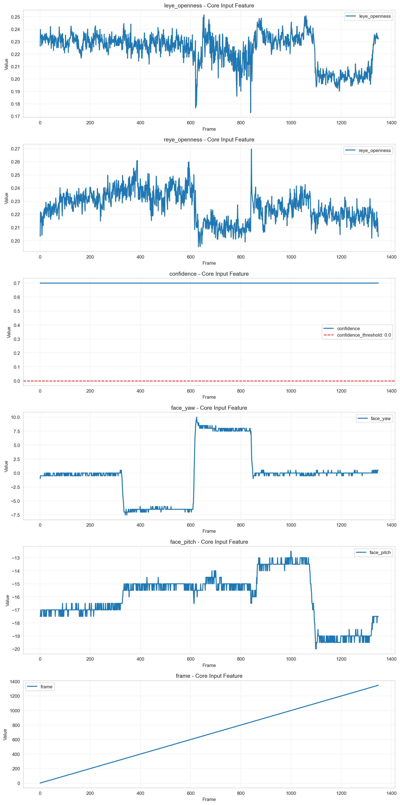

# 個別データ分析レポート - 1_4

## 概要

- 結論: アルゴリズムは期待値に対して不適切な検知結果を示しており、入力データの信頼性や閾値設定に問題がある可能性があります。
- 解析対象動画: 1_4
- フレーム区間: 421 - 519
- 期待値: 1
- 検知結果: 連続閉眼状態が検知されず、期待値と一致しない結果が得られました。

## 確認結果

アルゴリズム出力結果

コア出力結果

- 入出力の確認結果: アルゴリズム出力では連続閉眼状態が検知されず、期待値の1に対して0の出力が多く見られました。コア出力データも同様の傾向を示しています。
  
- 考えられる原因:
  - 顔検出信頼度が閾値を下回るフレームが多く、正確な閉眼判定が行われなかった。
  - 左右の目の開眼度が閾値を超えており、連続閉眼状態と判定されなかった。
  - 入力データのノイズや外れ値が影響し、アルゴリズムの判断に誤りを生じさせた。

## 推奨事項

- 顔検出信頼度の閾値を見直し、より多くのフレームで有効なデータを取得できるようにする。
- 左右の目の開眼度の閾値を調整し、より敏感に閉眼状態を検知できるようにする。
- 入力データの前処理を強化し、外れ値やノイズを除去する手法を検討する。

## 参照した仕様/コード（抜粋）

- 連続閉眼検知アルゴリズム仕様書 (AS_drowsy_detection)
- 評価環境仕様: C:\workspace\ImproveAlgorithmDevelopment\ai_analysis_engine\external\drowsy_detection\evaluation_engine\README.md
- アルゴリズム出力データ: ../development_datas/03_algorithm_output/v0.1.1+fa5172ba/20250922-133705/1.csv
- コア出力データ: ../development_datas/02_core_lib_output/v1.0.0/4/WIN_20250819_10_16_17_Pro_analysis.csv

## アルゴリズム設定情報
- アルゴリズム名: Unknown Algorithm
- 閾値設定: {}
- 必須列: []
