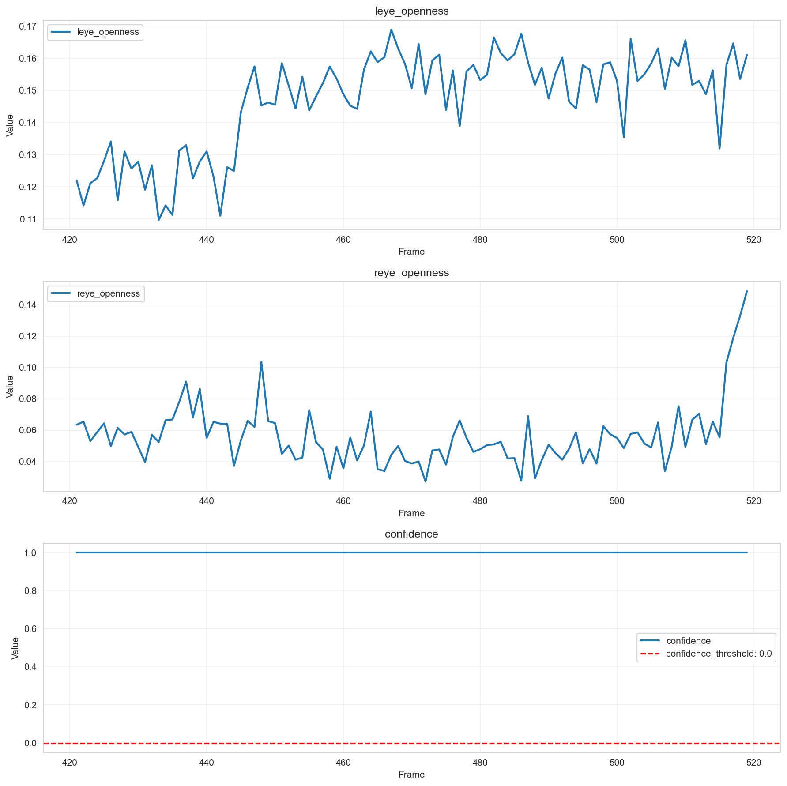

# 個別データ分析レポート - 1_4

## 概要

- 結論: 連続した閉眼状態が検知されず、アルゴリズムの閾値設定や入力データの特性が影響している可能性があります。
- 解析対象動画: 1_4
- フレーム区間: 421 - 519
- 期待値: 1
- 検知結果: すべてのフレームで「非連続閉眼状態」と判定されました（is_drowsy = 0）。

## 確認結果

アルゴリズム出力結果

コア出力結果

- 入出力の確認結果: 
  - 左目の開眼度 (mean=0.147, median=0.152) と右目の開眼度 (mean=0.056, median=0.052) の値から、右目の開眼度が非常に低く、左目も閾値に近い値であることが確認されました。
  - 顔検出信頼度は常に1.0であり、信頼性は高いと評価されますが、連続閉眼状態の判定には至りませんでした。

- 考えられる原因:
  - 右目の開眼度が非常に低いため、閾値を下回ることができず、連続閉眼状態と判定されなかった。
  - 左目の開眼度も閾値に近いため、両目が閉眼状態と見なされる時間が不足している可能性がある。
  - 入力データの特性により、連続した閉眼状態が発生していない可能性も考えられる。

## 推奨事項

- 閾値設定の見直し: 左右の目の開眼度の閾値を再評価し、特に右目の閾値を下げることを検討してください。
- データ収集の改善: より多様なシナリオでのデータ収集を行い、アルゴリズムの適用範囲を広げることを推奨します。
- アルゴリズムの調整: 連続閉眼状態の判定に必要な時間閾値を短縮することを検討し、より敏感な検知を目指してください。

## 参照した仕様/コード（抜粋）
- 連続閉眼検知アルゴリズム仕様書 (AS_drowsy_detection)
- 評価環境仕様: Evaluation Engine README.md
- アルゴリズムの処理フローと擬似コード

---

## アルゴリズム設定情報
- アルゴリズム名: Unknown Algorithm
- 閾値設定: {}
- 必須列: []
