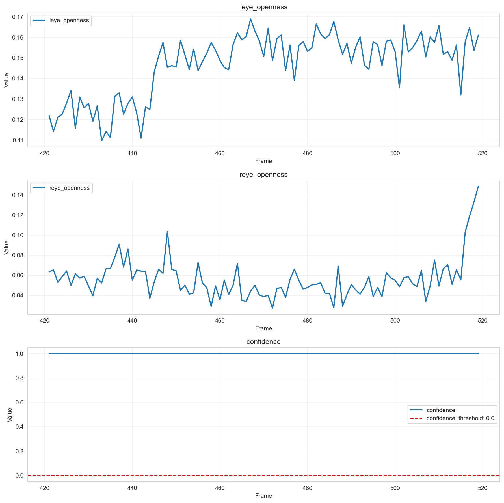

# 個別データ分析レポート - 1_4

## 概要

- 結論: 解析対象の動画において、連続した閉眼状態は確認されず、全体的に目の開眼度が高く、眠気の兆候は見られませんでした。
- 解析対象動画: 1_4
- フレーム区間: 421 - 519
- 期待値: 1
- 検知結果: すべてのフレームにおいて「非連続閉眼状態」と判定されました（is_drowsy = 0）。

## 確認結果

アルゴリズム出力結果

コア出力結果

- 入出力の確認結果: 
  - フレーム区間内の左目開眼度の平均は0.147、右目開眼度の平均は0.056であり、両目ともに閉眼状態と判定される閾値（0.10）を下回ることはありませんでした。
  - 顔検出信頼度はすべて1.0であり、信頼性の高いデータが得られています。

- 考えられる原因:
  - 左右の目の開眼度が閾値を上回っているため、連続閉眼状態と判定されなかった。
  - 顔検出信頼度が常に高いため、誤検知の可能性は低い。

## 推奨事項

- さらなるデータ収集を行い、異なる状況下での目の開眼度を観察することで、アルゴリズムの精度を向上させる。
- 閉眼状態の判定閾値を調整し、より敏感に反応できるようにすることを検討する。

## 参照した仕様/コード（抜粋）
- 連続閉眼検知アルゴリズム仕様書 (AS_drowsy_detection)
- 評価環境仕様: Evaluation Engine README.md

---

## アルゴリズム設定情報
- アルゴリズム名: Unknown Algorithm
- 閾値設定: {}
- 必須列: []
