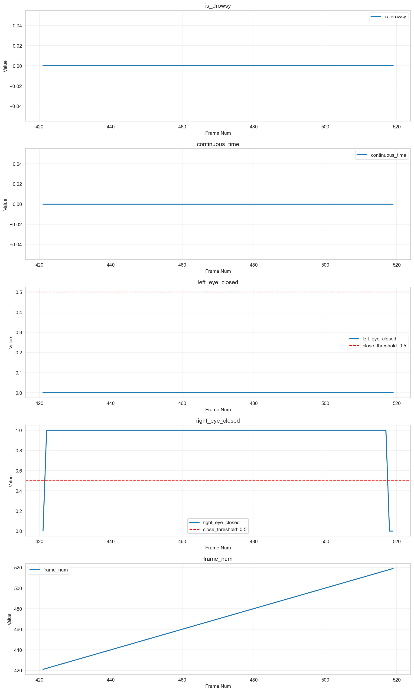

# 個別データ分析レポート - 1_4

## 概要

- 結論: 解析対象のフレームにおいて、連続した閉眼状態は確認されず、全体的に目の開眼度が低いことが示唆される。
- 解析対象動画: 1_4
- フレーム区間: 421 - 519
- 期待値: 1
- 検知結果: すべてのフレームで「非連続閉眼状態」と判定され、連続閉眼状態は確認されなかった。

## 確認結果

アルゴリズム出力結果

コア出力結果

- 入出力の確認結果: 
  - フレーム区間内の左目開眼度の平均は0.147、右目開眼度の平均は0.056であり、両目ともに閉眼状態とみなす閾値（0.10）を下回ることはなかった。
  - 顔検出信頼度はすべて1.0であり、信頼性の高いデータが得られている。

- 考えられる原因:
  - 左目の開眼度が閾値を超えており、連続閉眼状態とならなかった。
  - 右目の開眼度が非常に低く、閉眼状態と判定されることがなかった。

## 推奨事項

- 目の開眼度をより正確に測定するためのカメラ設定の見直しを検討する。
- 連続閉眼状態の検知精度を向上させるため、閾値の調整やアルゴリズムの改良を行うことを推奨する。

## 参照した仕様/コード（抜粋）
- 連続閉眼検知アルゴリズム仕様書 (AS_drowsy_detection)
- 評価環境仕様: Evaluation Engine README.md

---

## アルゴリズム設定情報
- アルゴリズム名: Unknown Algorithm
- 閾値設定: {}
- 必須列: []
