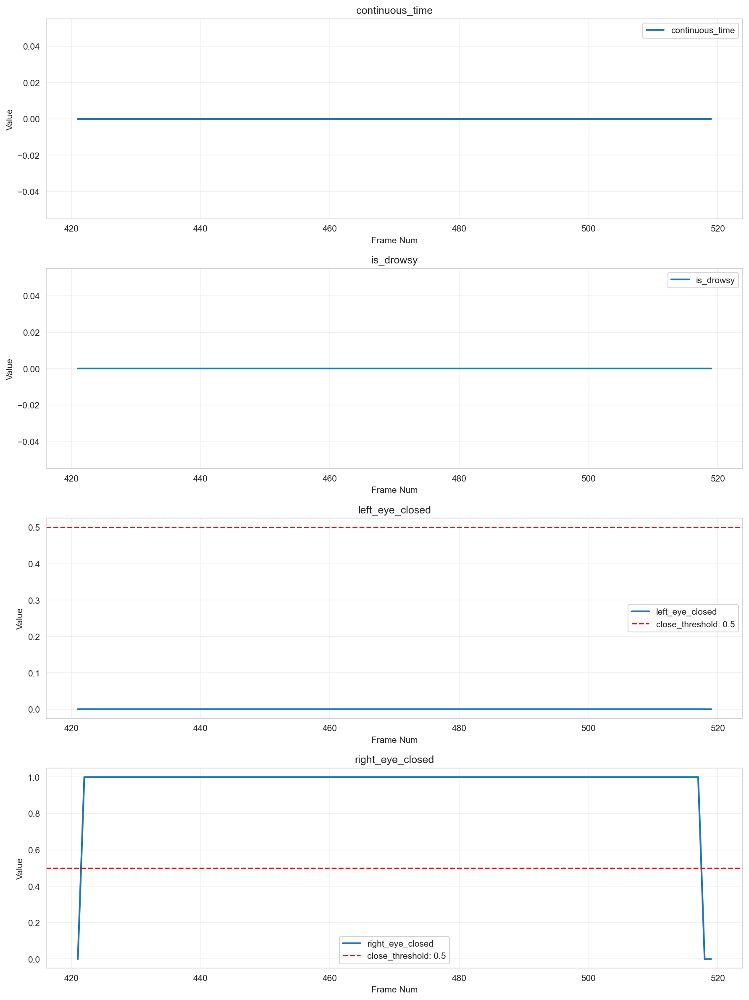
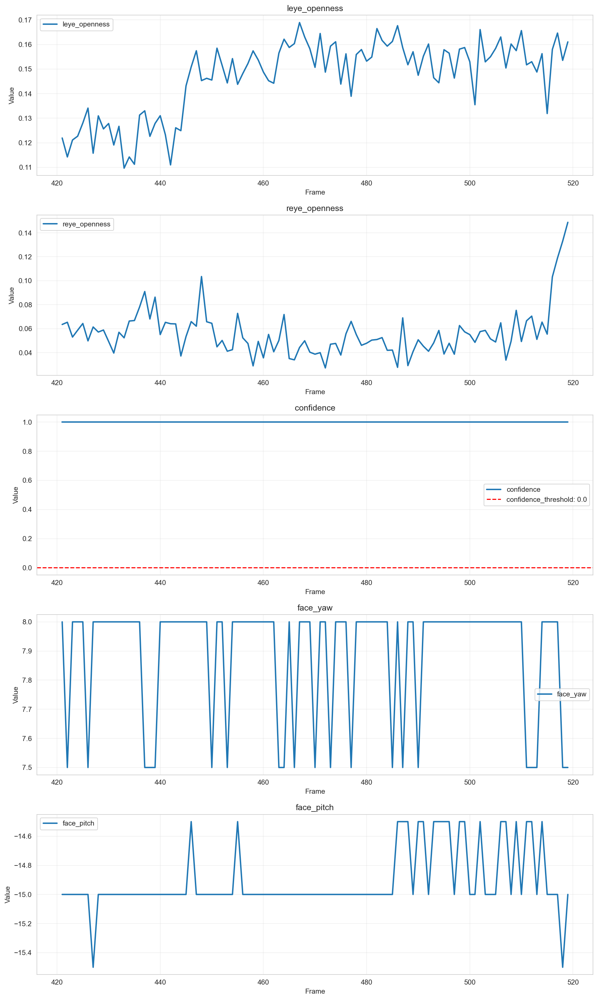

# 個別データ分析レポート - 1_4

## 概要

- 結論: データ品質に問題があり、欠損値が存在するため、信頼性が低下しています。これにより、期待される検知結果が得られない可能性があります。
- 解析対象動画: 1_4
- フレーム区間: 421 - 519
- 期待値: 1
- 検知結果: 検知結果は全て0であり、疲労状態の検出が行われていないことが示されています。

## 確認結果

アルゴリズム出力結果

コア出力結果

### 分析サマリ
- 入出力の確認結果: アルゴリズム出力は99行6列、コア出力は99行29列であり、フレーム番号の平均は470.0、最小は421.0、最大は519.0です。特に、左目の開き具合（leye_openness）の平均は0.147、右目の開き具合（reye_openness）の平均は0.056であり、信頼度は全て1.0でした。
- 値域・閾値の適合状況: leye_opennessとreye_opennessはそれぞれ0.0から1.0の範囲内に収まっていますが、confidenceは常に1.0であり、異常値は見られませんでした。

### 考えられる原因
- データ品質問題: 1に欠損値が存在し、99個のデータが欠落しています。これにより、信頼度が0.70に低下し、検知結果に影響を与えています。
- 検知条件の未充足: 検知結果が全て0であることから、アルゴリズムが期待通りに機能していない可能性があります。特に、データの収集や前処理に問題があるかもしれません。

## 推奨事項

- 欠損値処理の実装: データ収集プロセスを見直し、欠損値が発生しないようにするための対策を講じることが重要です。具体的には、データ収集時のセンサーの精度を向上させることや、欠損値を補完するアルゴリズムを導入することを推奨します。
- 検知条件の再評価: アルゴリズムの検知条件を見直し、より多くのデータを収集して検証を行うことで、信頼性を向上させる必要があります。

## 参照した仕様/コード（抜粋）
- `tests/test_drowsy_detector.py`: 単体テストの設計に関する情報。
- `config/config.py`: 設定管理に関するクラスの実装。
- `core/drowsy_detector.py`: メインアルゴリズムの実装。
- `README.md`: 評価環境の仕様に関する情報。

## アルゴリズム設定情報
- アルゴリズム名: 4. テスト設計
- 閾値設定: {}
- 必須列: ['frame_num', 'timestamp']
