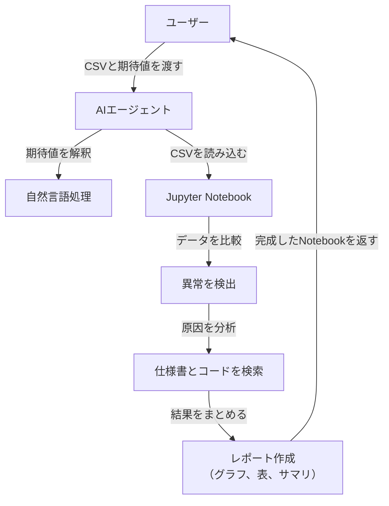

# AIアルゴリズム異常解析システム 仕様書（最新版）

この仕様書は、AIアルゴリズム異常解析システムの最新設計を詳細に説明するものです。ユーザーが提供するCSVデータ（アルゴリズムの検知結果）と自然言語で記述された期待値をもとに、AIエージェントが異常を解析し、Jupyter Notebookにわかりやすいレポートを生成します。初心者でも利用しやすく、高度な解析が可能な設計を目指しました。

---

## 目次
1. [システム概要](#1-システム概要)  
2. [システムの流れ](#2-システムの流れ)  
3. [入力と出力](#3-入力と出力)  
4. [主要コンポーネント](#4-主要コンポーネント)  
5. [機能の詳細](#5-機能の詳細)  
6. [システムの動かし方](#6-システムの動かし方)  
7. [サンプルコード](#7-サンプルコード)  
8. [初心者向け解説](#8-初心者向け解説)  
9. [まとめ](#9-まとめ)  

---

## 1. システム概要

### 1.1 目的
このシステムは、アルゴリズムが生成した結果（CSV形式）とユーザーが期待する結果（自然言語）を比較し、異常が発生している箇所を特定します。さらに、その原因を分析し、Jupyter Notebookに視覚的でわかりやすいレポートとして出力します。

### 1.2 対象ユーザー
- **初心者**: プログラミングやデータ分析の知識が少ない人でも簡単に使える設計。
- **開発者**: アルゴリズムの動作検証やデバッグを行いたい人。

### 1.3 主な特徴
- **自然言語対応**: 複雑な期待値（例: 合計、パターン、条件付き期待値）を解釈可能。
- **Jupyter Notebook統合**: コード、グラフ、表、サマリを一つのファイルに集約。
- **AIエージェントの自動化**: LangChainを活用し、タスクを自律的に処理。
- **異常原因の特定**: 仕様書とソースコードを基に、異常の根本原因を明確化。

---

## 2. システムの流れ

システムの動作をステップごとに説明し、視覚的な理解を助けるフローチャートを用意しました。

### 2.1 全体の流れ
1. **データ入力**: ユーザーがCSVファイルと自然言語の期待値をシステムに提供。
2. **期待値解釈**: AIが自然言語を数値や条件に変換。
3. **データ比較**: CSVの結果と期待値を比較し、異常を検出。
4. **原因分析**: 仕様書やソースコードを参照し、異常の原因を特定。
5. **レポート生成**: Jupyter Notebookに結果をまとめ、グラフや表を追加。
6. **出力**: 完成したレポートをユーザーに提供。

### 2.2 フローチャート


---

## 3. 入力と出力

### 3.1 入力
システムが処理に必要とするデータは以下の4つです：
1. **CSVファイル**: アルゴリズムの検知結果。
   - 例:  
     ```
     frame,value
     1,3
     2,4
     10,15
     ```
2. **仕様書（Markdown）**: アルゴリズムの動作仕様。
   - 例: `spec.md`
     ```markdown
     ## 仕様
     - フレーム10の値は5になるべき。
     ```
3. **ソースコード（Python）**: アルゴリズムの実装。
   - 例: `source.py`
     ```python
     def detect_value(frame):
         if frame == 10:
             return 15  # 仕様では5のはずがバグで15
         return frame
     ```
4. **期待値（自然言語）**: ユーザーの期待する結果。
   - 例: 「フレーム10では値が5であるべき」

### 3.2 出力
- **Jupyter Notebook**: 解析結果をまとめたファイル。
  - **内容**:  
    - 異常箇所（例: フレーム10で値が15）。
    - 期待値との差（例: 差分 = 10）。
    - 原因（例: ソースコードの条件分岐ミス）。
    - グラフや表による視覚化。
    - 初心者向けサマリ。

---

## 4. 主要コンポーネント

システムを構成する主要な部品を以下に示します。

### 4.1 AIエージェント（LangChain）
- **役割**: ユーザーの指示を理解し、タスクを自動実行。
- **技術**: LangChainライブラリ。

### 4.2 Jupyter Notebook
- **役割**: データ解析とレポート生成。
- **技術**: Jupyter MCPサーバーでリモート操作。

### 4.3 ツール
- **自然言語処理**: 期待値を解釈（OpenAI ChatGPTモデル）。
- **データ処理**: CSVを処理（Pandas）。
- **グラフ作成**: 視覚化（Matplotlib）。
- **検索（RAG）**: 仕様書やコードから情報を抽出。

---

## 5. 機能の詳細

### 5.1 自然言語の期待値の解釈
- **対応範囲**
  - **単一値**: 「フレーム10の値は5であるべき」
  - **集計**: 「フレーム1から10の合計が50であるべき」
  - **パターン**: 「値はフレームごとに単調増加するべき」
  - **条件付き**: 「フレームが偶数の場合、値は10を超えるべき」

- **実装方法**
  - **NLP強化**: OpenAIモデルを活用し、自然言語を数値条件や論理式に変換。
  - **文脈理解**: キーワード（例: 合計、単調増加）に基づき解析手法を自動選択。
  - **曖昧性対応**: 不明瞭な期待値にはフィードバックを返す。

- **例**
  - **入力**: 「フレーム1から5の平均が10であるべき」
  - **解釈**: `df.loc[df['frame'].between(1, 5), 'value'].mean() == 10`
  - **処理**: CSVから平均を計算し、期待値と比較。

### 5.2 異常原因の特定メカニズム
- **プロセス**
  1. **異常検出**: CSVと期待値を比較（例: フレーム10で15、期待値5）。
  2. **仕様書参照**: RAGで仕様書から関連情報を抽出。
  3. **コード解析**: AST解析でソースコードの異常箇所を特定。
  4. **原因特定**: 仕様とコードの不一致を分析。

- **要件**
  - **仕様書**: Markdownで明確に記述。
  - **コード**: Pythonで可読性高く書かれていること。

- **高度な分析**
  - 値の不一致だけでなく、ロジックエラーも検出。
  - 複数異常の関連性を分析。

- **例**
  - **異常**: フレーム10で値が15（期待値5）。
  - **仕様書**: 「フレーム10の値は5」
  - **コード**: `if frame == 10: return 15`
  - **原因**: コードの戻り値ミス。

### 5.3 Jupyter Notebookの出力レポートの構造とカスタマイズ性
- **構造**
  ```
  # 異常解析レポート
  ## 概要
  - データ: data.csv
  - 期待値: "フレーム10の値は5であるべき"
  ## 異常の詳細
  ### 異常1
  - **場所**: フレーム10
  - **検出値**: 15
  - **期待値**: 5
  - **差分**: 10
  - **原因**: `detect_value`関数のミス
  - **グラフ**: [差分グラフ]
  ## サマリ
  - 初心者向け: フレーム10で値が大きすぎます。コードのミスです。
  ```

- **複数異常**
  - 各異常をセクション分けし、関連性を記載。

- **カスタマイズ性**
  - **オプション**: グラフや詳細度の選択。
  - **テンプレート**: Markdownセルを編集可能。

### 5.4 AIエージェントの自律性と意思決定の範囲
- **自律性**
  - **タスク選択**: 指示から必要な処理を自動決定。
  - **ツール選択**: 期待値に応じたツールを適用。
  - **順序最適化**: タスクの依存関係を考慮。

- **エラー対応**
  - **曖昧な入力**: 具体性を求めるフィードバック。
  - **データ不足**: 欠落を報告。
  - **例外処理**: 代替案を提案。

- **例**
  - **入力**: 「フレーム10の異常を調べて」
  - **処理**: 期待値解釈→比較→原因特定→レポート生成。

---

## 6. システムの動かし方

### 6.1 データ準備
1. CSVファイル（例: `data.csv`）。
2. 仕様書（例: `spec.md`）とソースコード（例: `source.py`）。
3. 期待値を記述（例: 「フレーム10では値が5であるべき」）。

### 6.2 システム起動
1. Jupyter Notebookを開く。
2. サンプルコードを実行。

### 6.3 結果確認
- Notebookに追加されたグラフやサマリを確認。

---

## 7. サンプルコード

### 7.1 Jupyter Notebook接続
```python
from langchain_mcp_adapters import MultiServerMCPClient

client = MultiServerMCPClient(
    servers={
        "jupyter": {
            "transport": "streamable_http",
            "server_url": "http://localhost:8888",
            "document_url": "http://localhost:8888",
            "runtime_url": "http://localhost:8888",
            "document_id": "analysis.ipynb",
            "document_token": "MY_TOKEN",
            "runtime_token": "MY_TOKEN",
        }
    }
)
tools = client.load_tools()
```

### 7.2 期待値解釈
```python
from langchain.chat_models import ChatOpenAI

model = ChatOpenAI()
expected_value_text = "フレーム10では値が5であるべき"
prompt = f"以下の期待値を具体的な数値に変換してください: {expected_value_text}"
result = model.predict(prompt)
```

### 7.3 データ解析
```python
code = """
import pandas as pd
df = pd.read_csv('data.csv')
expected = {'frame': 10, 'expected_value': 5}
result = df[df['frame'] == expected['frame']]
result['difference'] = result['value'] - expected['expected_value']
result.to_csv('result.csv')
"""
tools['insert_execute_code_cell'](code)
```

### 7.4 グラフ作成
```python
code = """
import matplotlib.pyplot as plt
result.plot(kind='line', x='frame', y='difference')
plt.title('異常の差分')
plt.xlabel('フレーム')
plt.ylabel('差分')
plt.savefig('result.png')
"""
tools['insert_execute_code_cell'](code)
```

### 7.5 サマリ追加
```python
summary = """
## サマリ
- **異常の場所**: フレーム10で値が15（期待値は5）。
- **原因**: ソースコードの`detect_value`関数で15を返すミス。
"""
tools['append_markdown_cell'](summary)
```

---

## 8. 初心者向け解説

- **Jupyter Notebook**: コードと結果を一緒に見られるツール。
- **AIエージェント**: 指示を理解して作業を進める助手。
- **自然言語処理**: 言葉をAIが理解する技術。
- **Pandas**: 表データを扱うツール。
- **Matplotlib**: グラフを描くツール。

